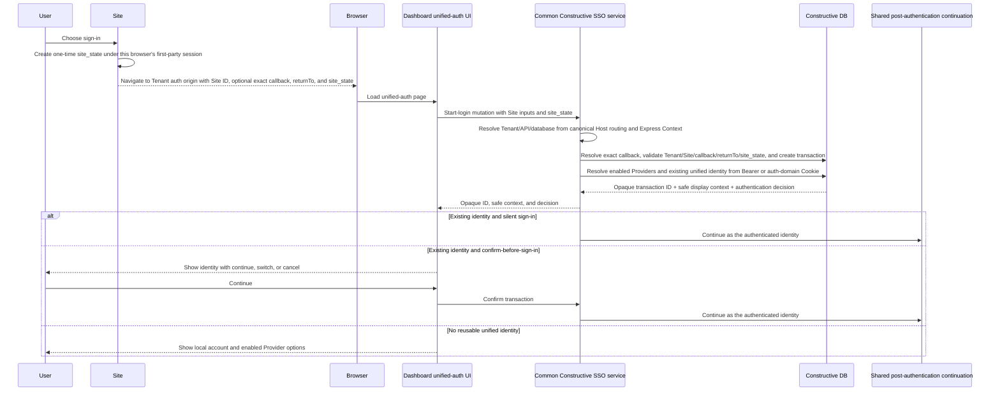

# OAuth and Cross-Domain SSO Requirements

## Purpose

Constructive must provide a complete OAuth sign-in experience and a unified
SSO entry point for applications that may live on different parent domains.

This document defines the final CNC behavior. The work may be delivered through
several package-focused changes, but those changes must converge on the same
requirements rather than becoming independent OAuth implementations.

Dashboard hosts the unified authentication pages, branding, and browser
interaction. Unified authentication is an independent platform capability: it
must continue to work without entering or depending on Dashboard's database,
organization, or other management features.

## User outcome

A user can select an OAuth provider configured by the current tenant, complete
the provider's authentication flow, and return to the application as the same
Constructive user on every subsequent login.

After authenticating through the unified auth entry, the user can establish a
session on another registered Constructive application even when that
application uses a different parent domain. The user must not need to repeat
the upstream provider login while the unified authentication session remains
valid and applicable policy permits SSO.

Creating an account through OAuth authenticates an identity; it does not grant
tenant roles, schema access, API access, or data permissions. Existing
Constructive authorization remains authoritative.

The unified authentication page always offers Constructive account/password
sign-in, registration, and password recovery. In the initial release, successful
local account/password registration immediately establishes the browser's
unified authentication session and continues the originating Site login flow.
Email verification is not a prerequisite for that session or later password
sign-in.

## Tenant, Site, and callback registration

A Tenant manages the Sites that may use unified authentication.

- Each Site has a stable Site identifier within its Tenant.
- A Site may register multiple allowed callback URLs.
- Each callback URL is registered individually and matched exactly, including
  scheme, host, port, path, and any registered fixed components.
- Wildcards, parent-domain suffix matching, similar hostnames, and temporary or
  request-supplied callback URLs are not trusted.
- Browser-supplied Site identifiers and callback URLs are request inputs only.
  They become trusted targets only after exact validation against current Tenant
  configuration.
- A disabled Site or removed callback cannot start a new login transaction.
  The Site and callback are revalidated before the final result or handoff is
  issued, so an in-progress flow fails safely after reassignment or removal.

Each Site has one Tenant-managed authentication mode:

- **Confirm before sign-in (default):** when the browser already has a valid
  unified session, the authentication center shows a lightweight account
  confirmation page before issuing a Site handoff.
- **Silent sign-in:** when the browser has a valid unified session and no other
  interaction is required, the center may complete the handoff without showing
  the confirmation page.

An absent mode always resolves to confirm before sign-in. A request parameter,
Site type, or historical behavior cannot enable silent sign-in.

## Provider requirements

Provider availability is registry- and configuration-driven.

- Every provider exposed by the `packages/oauth` provider registry must use the
  common OAuth flow. The current registry contains Google, GitHub, Facebook,
  and LinkedIn.
- A tenant sees and can use exactly the supported providers that it has enabled
  and configured.
- An unconfigured or disabled provider is not advertised and cannot be used.
- Adding another provider to the package registry must not require a separate
  server workflow or provider-specific route design.
- The common SSO flow uses a protocol-neutral Provider Adapter. Provider-specific
  OAuth or OIDC endpoint, request, token, verification, and profile-retrieval
  behavior stays inside its adapter and must not create a separate SSO state,
  identity, or session workflow.
- The Adapter pattern is a protocol-neutral interface or contract covering
  authorization initiation and callback/code-to-normalized-identity completion.
  Google and GitHub each implement it, and future Providers add another adapter;
  no abstract base class or inheritance hierarchy is required.
- Login-transaction and OAuth-state validation, account matching or provisioning,
  and shared post-authentication handoff orchestration remain in the common
  Constructive service rather than any Provider adapter.
- Every adapter normalizes success to the same minimal external identity:
  Provider service key, stable Provider user identifier or subject, email when
  available, and safe profile details. Constructive consumes only that normalized
  identity outside the adapter.
- The Google/OIDC adapter exchanges the authorization code server-side,
  validates the returned identity token as identity proof, and normalizes the
  resulting user data. An access token may also be returned, but v1 neither
  retains nor uses it for SSO when the validated identity data is sufficient.
- The GitHub/OAuth adapter exchanges the authorization code server-side for an
  access token, uses it server-side to retrieve the GitHub user and, when needed,
  email data, and then normalizes that result.
- Provider callbacks return an authorization code plus OAuth state, or an error;
  they do not return Provider tokens to the browser. Provider tokens remain
  inside the server-to-Provider adapter boundary.
- Unsupported provider capabilities or token authentication methods fail
  explicitly; they must not silently downgrade the security flow.
- Provider credentials and metadata are resolved for the current tenant and
  database. There is no platform default, cross-tenant, or old-version fallback.

Provider discovery is exposed through GraphQL. The old HTTP provider-list or
landing endpoint is not part of the target API. The unified authentication page
reads the current Tenant's enabled providers through the existing registry and
configuration surfaces; page code must not contain a fixed provider list.
Provider names used as concrete adapter or test examples, including Google and
GitHub, never form a release-specific product allowlist. Any Provider supported
by the running server's adapter registry and enabled with complete configuration
for the current Tenant appears through the same discovery and UI flow without a
Dashboard workflow change.

## Unified authentication experience

The unified authentication page always provides:

- Constructive account/password sign-in;
- Constructive account registration;
- Constructive password recovery; and
- the third-party providers currently enabled and configured for the Tenant.

When confirmation is required, the page displays only the current account's
basic identifying information, such as name and avatar, together with:

- continue;
- switch account; and
- cancel.

The confirmation page is not a verbose permissions or authorization-consent
page. Site roles, permissions, and data access remain owned by existing
Constructive authorization.

The browser enters through the current Tenant's canonical, Tenant-scoped
unified-authentication origin with a Site identifier, optional exact callback
URL, optional Site-internal application-relative `returnTo`, and a Site-created
`site_state` correlation value. The authentication origin must resolve through
the existing authoritative Host routing and full Express request context; the
flow does not accept a browser-supplied Tenant/database selector or search
another Tenant's authentication state. When the callback is supplied, it must
exactly match an active registered callback. When it is omitted, the center
selects the earliest registered callback by `created_at` ascending and then ID
ascending. Exact public route names are not fixed by this requirements
document.

Before navigation, the Site creates a cryptographically random, short-lived,
one-time `site_state` and records it under the current browser in its own
first-party server-side session boundary. Constructive binds that value to the
server-side login transaction and returns it beside the handoff code at the
exact Site callback. The Site must match the callback value to the same
browser's pending login before redemption and consume it after successful
redemption. Missing, expired, mismatched, or replayed `site_state` fails safely.
The value is public correlation only: it contains no identity, session,
credential, callback, or `returnTo` data.

## OAuth flow requirements

- OAuth is an explicitly enabled server capability and is disabled by default.
- When disabled, provider discovery returns no providers and browser OAuth
  initiation/callback routes are not mounted.
- Enabling OAuth requires valid server configuration at options/startup time.
- Before any authentication begins, the center validates the Site and exact
  callback against current Tenant configuration and creates a ten-minute,
  single-use login transaction bound to that Site, callback, and browser.
- Every provider uses Authorization Code flow with S256 PKCE.
- Each initiation creates a one-time verifier/challenge pair. The verifier is
  never placed in a redirect URL and is bound to the corresponding callback.
- Dashboard sends the unified login transaction identifier and selected Provider
  only to Constructive. Constructive creates the existing server-side OAuth
  authorization-request state, associates it with that transaction, and gives
  that Provider request its own ten-minute expiry.
- The browser and external Provider receive only a cryptographically random,
  opaque OAuth state value, never the unified login transaction identifier.
  Server-side state binds the Provider, Tenant, database, Site, exact callback,
  originating API/host, browser, PKCE relation, and original login transaction.
- The callback re-resolves the current route and target application. Any
  expired, modified, replayed, or mismatched state, provider, tenant, database,
  Site, callback, browser, host, API, or PKCE value is rejected.
- The technical callback must be registered and exactly validated. `returnTo`
  is a separately validated Site-internal, application-relative destination;
  it cannot name another Site or origin. Open redirects are forbidden.
- Provider authorization, token, and user-info endpoints must use HTTPS and
  reject loopback, private, link-local, and reserved network destinations.
- Server-to-provider requests use bounded timeouts and do not automatically
  follow redirects.
- Provider token and profile responses are strictly validated before use and
  normalized to the minimum identity data required by the owned database
  contract. Raw provider payloads are not persisted.

The browser HTTP surface is limited to semantics that GraphQL cannot replace:
authorization initiation, provider callback, and the redirects or cookie
operations required to complete authentication.

The Provider callback may contain a code or a Provider error. Constructive first
validates and consumes the opaque OAuth state, restores the configured Provider
and original unified login transaction server-side, and then asks the selected
adapter to exchange or verify the Provider result.

Provider cancellation, a Provider-reported error, invalid state, or Provider
exchange or verification failure produces a clear, safe user-facing failure at
the authentication center. No handoff is issued and the failed Provider flow is
not resumed; the user restarts from the Site login entry with a new login
transaction. Raw Provider error fields are not forwarded. Every failed callback
performs the required transient-state cleanup and partial-work rollback.

## Login transaction and result routing

The exact Site/callback allowlist is the trust root for browser return routing.
Validation must happen before creating a login transaction, not after
authentication has already completed.

The authentication-center server stores the login transaction. The browser
holds only an opaque, cryptographically random transaction identifier; it does
not carry transaction contents, credentials, tokens, Site trust data, or other
sensitive state.

The server-side transaction expires ten minutes after creation and is
single-use. It binds the Tenant, Site, exact callback, and current browser.
Every confirmation action, provider callback, authentication result, handoff
issuance, and handoff consumption must match the same live, unused transaction.

When the transaction, Site, and callback remain trusted, the same registered
Site callback may receive:

- **success:** an opaque, short-lived, single-use handoff code for server-side
  consumption as a query parameter on a top-level browser `GET` navigation;
- **non-Provider user cancellation:** a stable cancellation result without a
  handoff when that interaction explicitly supports returning to the Site; or
- **a safely classified non-Provider failure:** a registered, non-sensitive
  result category when its routing remains trustworthy.

Provider cancellation and Provider-flow failures do not use this callback result
path; they follow the restart behavior in the OAuth flow requirements above.

The Site owns the presentation of these results on its callback page. The
callback never receives raw provider errors, provider authorization or access
tokens, Constructive access/session tokens, cookies, secrets, provider payloads,
or user-sensitive data.

If the login transaction is expired or used, state or callback binding is
modified, browser binding does not match, or the center cannot prove a trusted
target Site, the browser stays at a generic authentication-center failure page.
The center must not attempt a best-effort redirect using untrusted request data.

## Browser and session security

- The authentication center and every Site use only first-party session cookies
  within their own host or explicitly configured local-domain boundary. The
  design does not depend on third-party cookies or cookies shared across
  unrelated parent domains.
- Login, unified-session, and Site-session cookies are transmitted only over
  HTTPS, marked `Secure` and `HttpOnly`, restricted from unnecessary
  cross-site sending through an appropriate `SameSite` policy, and combined
  with the existing CSRF protections.
- Cookie domain, path, and lifetime are scoped as narrowly as the owning flow
  permits. Tenant configuration cannot broaden or weaken required protections.
- OAuth authorization-request state and PKCE verifier associations remain
  short-lived and server-side and are consumed on callback success or failure;
  they are not implemented as browser state/PKCE cookies.
- OAuth responses prevent caching and referrer leakage. Shared request logging
  redacts `/auth/*` query strings containing codes, state, or provider errors.
- The Site handoff callback redeems its query-carried code before rendering a
  page or loading third-party resources, prevents caching and referrer leakage,
  and immediately redirects to a clean `returnTo` after success. Proxy, access,
  APM, analytics, and error logging must redact the raw handoff and `site_state`
  query values.
- Site-side pending `site_state` records must be process-independent and support
  more than one concurrent login attempt for the same browser. A single
  overwrite-prone Cookie value or process-local replay map is not sufficient.
- A stale or existing application session must not change the pre-authentication
  privilege boundary used for identity lookup, linking, or session creation.
- OAuth and SSO do not bypass the target application's existing CORS or CSRF
  enforcement. Redirect validation, CORS, and CSRF remain separate controls.
- A login transaction and handoff are rejected after expiry, use, replay, or
  copying to another browser, Site, callback, Tenant, API, or database.
- The initial release does not provide a browser-session experience when the
  user disables all cookies. This is distinct from third-party-cookie blocking:
  the supported flow continues to use each domain's own first-party cookies.

## Identity lifecycle

- `constructive_user_identifiers_private.connected_accounts` is the durable
  Provider-identity association. Its Provider service key plus stable external
  identifier resolves the linked `owner_id`; safe additional Provider profile
  attributes remain in `details`.
- A Provider authorization code is transient protocol input and is never stored
  or treated as an identity. A stable Provider identifier or subject, not email,
  recognizes a returning Provider account.
- If the Provider identity is already linked, sign-in authenticates the linked
  local Constructive user and never creates a duplicate user or association.
- If the Provider identity is unlinked and its normalized email is not owned by
  a local account, the existing `sign_up_identity` path automatically provisions
  the application user, email, and connected-account association atomically.
- If the Provider identity is unlinked but its normalized email belongs to a
  different local account, sign-in fails explicitly with guidance to use the
  account's existing sign-in method. This flow does not automatically merge or
  bind accounts and does not ask for password-confirmation linking.
- Provider email verification is retained as metadata but does not block first
  login and does not authorize automatic account merging, recovery, or access.
- Identity creation and linking must be atomic: a failed flow must not leave a
  partial user or association.

Provider-owned MFA remains entirely within the Provider flow. Sites or flows
that require Constructive `strictAuth`, local MFA, or step-up authentication are
outside v1 SSO integration and fail closed rather than downgrading or bypassing
that policy. Their integration is deferred to a separate future design based on
an actual use case.

### Constructive local accounts

- Account/password sign-in, registration, and password recovery are permanent
  unified-auth page capabilities and do not depend on third-party provider
  configuration.
- Successful local authentication enters the same unified-session, Site-mode,
  handoff, and Site-local-session lifecycle as third-party authentication.
- In the initial release, successful account/password registration immediately
  establishes the unified session and continues the originating Site's login
  transaction.
- Email verification is not required before establishing that session or
  signing in later with the account/password credential.

## Unified SSO requirements

- The authentication entry and target application may use unrelated parent
  domains.
- Cross-domain SSO must not depend on a shared parent-domain cookie.
- The unified auth entry maintains a central session for the current browser.
  Each target Site maintains its own first-party local session cookie according
  to the browser and session security requirements above.
- Authentication may be handed from the unified entry to a verified target
  only through a short-lived, replay-resistant, server-consumed exchange.
- After a successful Provider callback, Constructive issues an HTTP `303`
  redirect to the validated technical Site callback with the one-time handoff
  code as a query parameter. Dashboard-mediated success paths perform the
  equivalent top-level `GET` navigation using a minimal, Constructive-validated
  continuation; Dashboard does not construct or alter the callback target.
- The target Site redeems the handoff through the Constructive GraphQL mutation
  backed by the handoff-redemption database function. Redemption additionally
  requires authoritative runtime `site_id`, `api_id`, and `principal_id` from
  trusted routing/runtime authentication. The transaction Site and the exact
  tuple authorized by `site_runtime_clients` must match before credential
  issuance or handoff consumption. Site is never inferred from API, and
  `Origin`/`Referer` are auxiliary checks rather than identity sources. This
  does not add an SSO-specific secret or credential system. Successful
  redemption consumes the handoff and returns a distinct Site-local credential
  result.
- The Site callback owns its first-party Bearer/Cookie completion and then
  redirects to the verified Site-internal, application-relative `returnTo`.
- The handoff is an opaque one-time authorization code only; it contains no
  identity, session, or long-lived credential. Reusable access tokens, session
  tokens, Provider tokens, PKCE verifiers, secrets, user details, raw `returnTo`,
  and unified login transaction identifiers must not appear in the Site callback
  URL or URL fragments.
- The target Site, API, service principal, host, tenant, and database are
  revalidated before a target session is established. Multiple Sites may use
  the same API; API identity alone never selects a Site.
- A handoff issued for one Site/runtime tuple, host, tenant, or database cannot
  be consumed through another Site, API, or service principal.
- Each Site-local session is bound to the unified session that established it.
  Every protected Site request validates that the bound unified session remains
  active. Revoking the unified session causes old Site-local sessions to be
  rejected even when their local cookies have not naturally expired.

The exact persistence and database procedure used for the handoff are design
decisions, but the observable security behavior above is required.

Route removal or reassignment during an in-progress login fails safely. Similar
hostnames, parent-domain suffixes, CORS allowlists, client-supplied database IDs,
and default-database routing do not establish SSO trust.

### Current-browser logout

- Unified logout revokes the current browser's unified session and the authority
  of every Site-local session bound to it.
- Sessions in other browsers are outside this operation's scope.
- Sites reject bound local sessions on the next protected request after central
  revocation.
- Revocation does not depend on Site logout callback URLs, browser redirects to
  every Site, or per-Site notification webhooks.

### Switch account

Switching from account A to account B first performs current-browser unified
logout for account A. The current Site then completes the active login
transaction for account B and establishes a B Site-local session. Other Sites
remain signed out. When the user later visits another Site, that Site follows
its Tenant-configured confirmation or silent mode to establish a new B session.

Account switching does not preserve usable A Site sessions and does not
background-sign-in every Site as B.

## Product interaction sequences

### Main Login Diagram 1: Start and Existing Unified Authentication



Constructive, not Dashboard, owns transaction creation, existing-authentication
validation, and the effective silent/confirm decision. The registered technical
callback is distinct from the validated application-relative `returnTo`; both
are retained in server-side transaction context. After login start, neither the
transaction ID nor raw `returnTo` is carried in browser navigation.

### Main Login Diagram 2: Local Username/Password Branch

```mermaid
sequenceDiagram
    participant U as User
    participant D as Dashboard unified-auth UI
    participant A as Common Constructive SSO service
    participant DB as Constructive DB
    participant P as Shared post-authentication continuation

    U->>D: Submit local credentials
    D->>A: Password mutation with opaque transaction ID + credentials
    A->>DB: Invoke SSO password wrapper and validate transaction boundaries
    alt Invalid transaction or password failure
        DB-->>A: Existing safe authentication error
        A-->>D: Safe failure
        Note over U,D: User may manually resubmit while the transaction remains active; no automatic retry
    else Successful local authentication
        DB-->>A: Identity + existing Dashboard credential outcome
        A->>P: Continue as the authenticated identity
    end
```

The SSO wrapper calls the existing Tenant-local
`constructive_auth_public.sign_in` email/password primitive once and does not
extend that primitive with SSO concerns. The separate `sign_in_identity`
primitive remains owned by Provider external-identity authentication. Any
Dashboard Bearer result and auth-domain first-party Cookie are local to the
authentication center; they are not the target Site's credential.

### Main Login Diagram 3: External Provider Branch

```mermaid
sequenceDiagram
    participant U as User
    participant D as Dashboard unified-auth UI
    participant B as Browser
    participant A as Common Constructive SSO service
    participant DB as Constructive DB
    participant PA as Protocol-neutral Provider Adapter
    participant IP as External Identity Provider
    participant P as Shared post-authentication continuation

    U->>D: Choose an enabled configured Provider
    D->>A: Provider-start operation with opaque transaction ID + Provider key
    Note over D,A: Dashboard gives the unified transaction ID only to Constructive
    A->>DB: Validate transaction/Provider and create linked OAuth authorization request
    DB-->>A: Random OAuth state; PKCE/nonce remain server-side
    A->>PA: Build Provider-specific authorization request
    A-->>B: Redirect with random OAuth state only
    B->>IP: Complete Provider interaction
    IP-->>B: Callback with code or error + random OAuth state
    B->>A: Provider callback
    A->>DB: Validate/consume OAuth state and restore Provider + original transaction
    alt Invalid, expired, or replayed OAuth state
        DB-->>A: Classified state failure
        A-->>D: Safe failure; restart from Site login entry
    else State restores configured Provider and original transaction
        DB-->>A: Restored transaction and Provider context
        alt Callback contains Provider cancellation/error
            A-->>D: Safe Provider failure; restart from Site login entry
        else Callback contains authorization code
            A->>PA: Complete callback through the selected configured adapter
            alt Google/OIDC adapter example
                PA->>IP: Exchange authorization code server-side
                IP-->>PA: Identity token + optional access token + user data
                PA->>PA: Validate identity token and normalize user data
            else GitHub/OAuth adapter example
                PA->>IP: Exchange authorization code server-side
                IP-->>PA: Access token
                PA->>IP: Query user and optional email endpoints
                IP-->>PA: User and optional email data
                PA->>PA: Normalize GitHub user data
            else Another supported adapter
                PA->>PA: Run adapter-specific verification
            end
            PA-->>A: Normalized Provider key + stable identifier + optional email + safe profile
            Note over B,IP: Browser sees code/state or error, never Provider tokens or the unified transaction ID
            A->>DB: Resolve connected_accounts by Provider + stable identifier
            alt Existing association
                DB-->>A: Linked local user
                A->>P: Continue as the linked identity
            else Unlinked and email is unowned
                A->>DB: Use existing sign_up_identity provisioning path
                DB-->>A: New local user + email + connected account
                A->>P: Continue as the provisioned identity
            else Unlinked and email belongs to another local account
                DB-->>A: Explicit account conflict
                A-->>D: Use existing sign-in method; restart login
            end
        end
    end
```

The authorization code is never an identity or durable association. Provider
adapters keep Google/OIDC, GitHub/OAuth, and other protocol details internal;
only the normalized external identity crosses into the common identity lifecycle.

### Shared Successful Completion

```mermaid
sequenceDiagram
    participant P as Shared post-authentication continuation
    participant A as Common Constructive SSO service
    participant DB as Constructive DB
    participant D as Dashboard unified-auth UI
    participant B as Browser
    participant S as Target Site

    P->>A: Authenticated identity + active transaction
    A->>DB: Preserve/establish auth-center credential outcome and create one-time Site handoff
    DB-->>A: Auth-center-local outcome + plaintext handoff emitted once
    alt Provider callback terminates at Constructive
        A-->>B: 303 to exact callback with handoff code + site_state query
    else Dashboard-mediated successful branch
        A-->>D: Minimal validated GET continuation
        D-->>B: Navigate to exact callback with handoff code + site_state query
    end
    B->>S: GET exact registered callback
    S->>S: Match site_state to this browser's pending login
    S->>A: Redeem-handoff GraphQL mutation
    A->>DB: Invoke handoff-redemption function
    DB-->>A: Distinct Site-local credential + verified returnTo; handoff consumed
    A-->>S: Site-local credential result + verified returnTo
    S->>S: Set its first-party Cookie and/or deliver its Bearer result
    S-->>B: Redirect to verified Site-internal returnTo
```

All successful routes in the three main diagrams enter this one continuation.
The handoff is carried only as an opaque, one-minute, one-time query value on a
top-level `GET` navigation to the fixed, registered technical callback. The Site
first matches `site_state` to the current browser, then redeems the handoff
before rendering or loading third-party resources. After successful server-side
redemption it consumes the pending Site state and immediately redirects to its
separately validated, Site-internal `returnTo` so the browser leaves the
code-bearing URL.
Authentication-center credentials and Site-local credentials remain distinct.

### Existing unified session

This case is the first diagram's silent or confirm branch. Silent sign-in skips
only the confirmation UI; neither branch skips Site/callback validation,
transaction creation, unified-session validation, handoff, or Site-local
credential establishment.

### Switch from account A to account B

```mermaid
sequenceDiagram
    participant U as Browser
    participant A as Common Constructive SSO service
    participant P as Shared post-authentication continuation
    participant SO as Other Sites

    U->>A: Select switch account
    A->>A: Revoke the browser's account A unified session
    U->>A: Authenticate account B
    A->>P: Continue B for the current Site transaction
    Note over P: Use the single shared handoff, callback, redemption, credential, and returnTo path
    Note over SO: Old A local sessions are rejected; no B session is created
    U->>SO: Visit later
    SO->>A: Start a new Site login
    Note over SO,A: Follow Main Login Diagram 1 and the shared completion for B
```

## Administrative management

- An authorized administrator can create, update, enable, and disable tenant
  provider configuration and rotate its client secret through the existing
  owned configuration surface.
- A Tenant administrator can create, update, enable, and disable Sites; manage
  each Site's stable identifier and multiple exact callback URLs; and select
  confirm-before-sign-in or silent sign-in.
- New Sites default to confirm before sign-in.
- Secret values are accepted only through the secret-management boundary and
  are never returned by provider configuration reads.
- Known configuration writes and secret rotations invalidate the relevant
  runtime cache after a successful write. External changes have a defined,
  bounded staleness period and do not require a server restart.
- Provider and auth-setting writes preserve authorization, validation, audit,
  and failure semantics; a new OAuth-specific admin REST surface is not required.

## Configuration and secret boundaries

- Server/platform OAuth settings are owned and validated by `graphql/env`.
- Tenant provider metadata is owned by tenant configuration.
- Tenant provider secrets use the existing internal-secrets lifecycle; OAuth
  does not store a second secret copy.
- Middleware consumes validated options and request-scoped configuration. It
  does not read `process.env` directly.
- Secrets and raw provider errors never enter browser responses, redirect
  parameters, ordinary configuration APIs, or logs.

## Errors and observability

- Public failures use registered, stable `UPPER_SNAKE_CASE` business error
  codes rather than package, route, middleware, or internal class names.
- Security validation failures identify the rejected business object without
  exposing sensitive values or database details.
- Every caught exception is deliberately mapped to a domain/protocol failure or
  rethrown with its cause preserved. Logging is not a substitute for failure.
- Logs may include safe request, provider identifier, tenant, API, and error
  classification context, but never credentials, tokens, cookies, codes, or
  provider response bodies.

## Protocol boundary

The common SSO orchestration and normalized external-identity contract are
protocol-neutral. Current OAuth-based adapters use OAuth 2.0 Authorization Code
with mandatory S256 PKCE. An OIDC-capable adapter must not claim complete OpenID
Connect verification unless issuer, audience, nonce, discovery, and JWKS
validation are separately defined and implemented. Provider-specific
OIDC-shaped responses do not by themselves make CNC an OIDC provider or make
the generic SSO flow an OIDC relying party.

## Completion criteria

The CNC implementation is complete when:

1. All providers registered by `packages/oauth` use the protocol-neutral adapter
   boundary and shared secure SSO flow, while Tenant configuration controls
   their availability.
2. Dashboard can host the unified-auth pages without making authentication
   depend on its management features.
3. Tenant-managed Sites support stable identifiers, multiple exactly matched
   callbacks, and confirm-before-sign-in by default or explicit silent sign-in.
4. The unified page always offers Constructive sign-in, registration, and
   password recovery, and obtains third-party providers dynamically.
5. Successful local account registration immediately establishes the unified
   session and continues the originating Site flow without an email-verification
   prerequisite.
6. Provider login resolves durable identity through existing
   `connected_accounts`; linked identities return their owner, eligible unlinked
   identities use `sign_up_identity`, and an email owned by another account
   fails without automatic merge or password-confirmation linking.
7. Unified SSO establishes sessions across registered applications on different
   parent domains without exposing reusable credentials.
8. Tenant/Site/callback/database/host boundaries are enforced during initiation,
   callback, identity resolution, and target-session establishment.
9. OAuth-disabled, missing configuration, Provider cancellation or rejection,
   malformed state, replay, Provider verification failure, routing mismatch,
   identity conflict, and exclusion of strict-auth/MFA/step-up flows have
   explicit fail-closed behavior and automated coverage at their owning layers.
10. Every Provider-flow failure is safely presented at the authentication center
    and requires a fresh login from the Site entry; it cannot resume the failed
    flow or expose raw Provider or sensitive data.
11. Login transactions and OAuth authorization requests are stored server-side
    and each expires ten minutes after its own creation. Dashboard receives only
    the active opaque transaction identifier, while the browser/Provider
    boundary receives only unrelated random OAuth state.
12. Login transactions and handoffs are single-use and bound to the correct
    browser, Site, callback, Tenant, API, and database; handoffs retain their
    separately confirmed one-minute lifetime.
13. The auth center and Sites use only narrowly scoped, protected first-party
    session cookies and retain the existing CSRF boundary; neither third-party
    cookies nor cross-parent-domain cookie sharing are required.
14. Endpoint validation, transient-cookie cleanup, cache/referrer protection,
    safe provider failure, and stale-session privilege boundaries are tested.
15. Current-browser logout causes every bound Site-local session to be rejected
    on protected requests, and account switching establishes the new account
    only for the currently active Site transaction.
16. Tenant provider changes and secret rotation take effect through the owned
    cache/invalidation lifecycle without leaking the secret.
17. Existing `connected_accounts` and identity procedures are reused; no parallel
    private identity table, configuration reader, request context, or duplicated
    Provider workflow is introduced by server middleware.

## Future consideration (not current scope)

An already authenticated local user may later be allowed to bind Google, GitHub,
or another Provider from account settings. Account-settings binding is not part
of the current unified-login flow or release scope.

## Implementation-owned details

The following choices do not require additional product decisions. Their owning
PRs select repository-conventional representations while preserving this
document and the formal Spec:

- login-transaction physical storage, opaque-identifier hashing, and cleanup;
- handoff indexes, cleanup scheduling, and bounded operational retention; and
- database constraint, locking, and migration mechanics that do not alter the
  confirmed security or product behavior.

## References

- OAuth PR [#1303](https://github.com/constructive-io/constructive/pull/1303)
- SSO PR [#1493](https://github.com/constructive-io/constructive/pull/1493)
- Latest-baseline OAuth PR [#1669](https://github.com/constructive-io/constructive/pull/1669)

These are behavioral, security, and regression references. Their implementation
structure and compatibility workarounds are not requirements.
