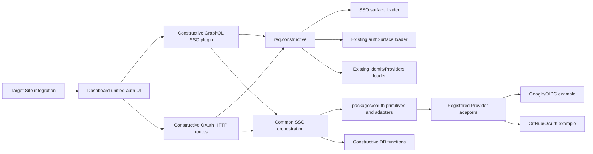
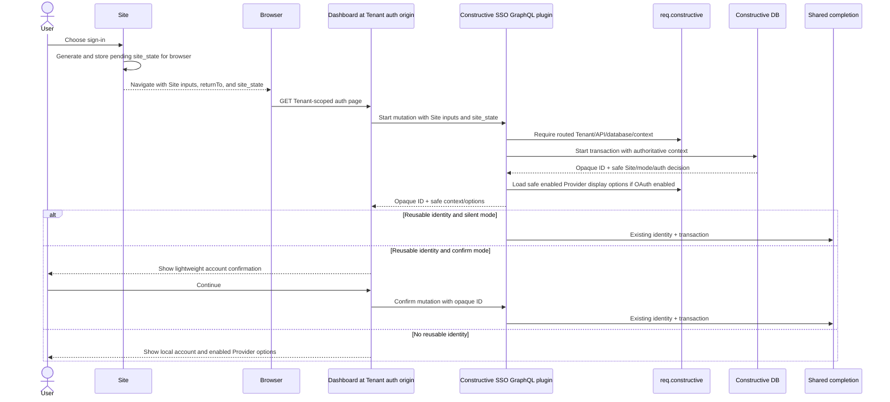

# OAuth/SSO Platform Integration — Constructive Detailed Design

## Document Status

This document is the implementation design for the Constructive repository.
It is derived from:

- the [product requirements](../plan/oauth-sso-platform-integration.md);
- the [formal platform specification](./oauth-sso-platform-integration.md); and
- the [Constructive DB detailed design](./oauth-sso-platform-integration-constructive-db-design.md).

The product and formal specification remain authoritative for observable
behavior. This document fixes Constructive package ownership, request lifecycle,
server interfaces, configuration, security controls, testing, and PR slicing.
Physical database objects and SQL atomicity remain owned by the DB design.

The original repository evidence in this design was inspected on branch
`feat/oauth-sso-platform-integration` at Constructive commit `5af7e77b4`. Final
convergence evidence uses the combined Constructive DB runtime commit
`ffc87bb07ede49a0734f676d0eb06042f0565eef`, the seven-PR Constructive stack
head `87061435f59a1410b19161c2ae2365cc0891da5d`, and Dashboard implementation
commit `a6611fbcab677e91c431f275bd02930b39828421`.

## Scope

This design covers:

- the Tenant-scoped unified-authentication entry in Constructive;
- full Express request-context and loader integration;
- GraphQL operations used by Dashboard and target Site servers;
- local password and registration orchestration;
- the protocol-neutral Provider adapter registry and concrete adapter implementations, with Google and GitHub documented as examples rather than a release allowlist;
- OAuth Authorization Code, S256 PKCE, state, callback, and identity resolution;
- authentication-center Cookie/Bearer completion;
- creation and browser delivery of the one-time Site handoff;
- Site-side `site_state` and redemption integration contracts;
- trusted Site runtime identity propagation and Site/API/principal authorization;
- configuration, errors, observability, tests, rollout, and package ownership.

## Non-Goals

- Dashboard page implementation or management UI implementation.
- Hub integration or cross-host browser E2E in this Constructive phase.
- A shared-parent-domain Cookie design, third-party Cookie dependency, or a
  global session shared across Tenants.
- A complete browser SSO experience when the user disables all first-party
  Cookies. Bearer remains supported for Site/API clients, but v1 browser
  correlation and auth-center session reuse use each domain's own Cookie.
- Strict-auth, local MFA, or step-up Site integration in v1.
- Account-settings Provider linking, automatic email-based account merge, or
  password-confirmation linking.
- Transaction recovery/status polling after an interrupted flow.
- A new OAuth/SSO secret store, Site-runtime credential system, request context,
  Provider registry, or identity-association table.
- Compatibility fallbacks for older Constructive DB versions, alternate schemas,
  legacy OAuth `lane`, or legacy `return_to` behavior.

## Confirmed Implementation Decisions

1. The unified-authentication origin is Tenant-scoped. Its Host is registered in
   the existing routing plane and must resolve through
   `routing_public.resolve_route(host, '/', NULL)` before any SSO operation.
2. `req.constructive` is the only request-level source for Tenant, API,
   database, route, session, user, request ID, database access, and loaders.
3. A browser-supplied Tenant/database identifier, path-derived Tenant, or global
   transaction/state scan is never an authentication authority.
4. The authentication-center session Cookie is host-only to the Tenant's auth
   origin. Another Tenant's auth Host receives a different first-party Cookie
   boundary and cannot reuse its session, OAuth state, transaction, or handoff.
5. The Site creates a cryptographically random, one-time `site_state`, stores it
   under the current browser in a process-independent first-party session
   boundary, and supplies it at login start. Constructive binds it to the login
   transaction and returns it beside the handoff. The Site validates it before
   redemption and consumes it after successful redemption.
6. Provider OAuth uses Authorization Code with mandatory S256 PKCE and
   server-side state for every Provider request handled by a registered adapter.
7. Successful completion uses a one-minute, one-time handoff code in a top-level
   `GET` callback query. It never carries identity or a reusable credential.
8. Local password, local registration, reused unified authentication, and every
   registered Provider adapter all enter the same post-authentication
   continuation.
9. Site-originated handoff redemption, Site credential issuance, and later Site
   authentication use an authoritative `(site_id, api_id, principal_id)` runtime
   tuple. `site_id` is a first-class routing/runtime fact and is never inferred
   from `api_id`; multiple Sites may share one API.
10. The DB-owned logical `site_runtime_clients` relation authorizes exact Site,
    API, and service-principal tuples. `Origin` and `Referer` are optional
    defense-in-depth signals, not Site identity sources.

## Verified Baseline and Implemented Evolution

The table records the original and second-round gaps that the final stacked
implementation is required to close. It is historical implementation evidence,
not a description of missing work in the final stack.

| Area                       | Original or second-round gap                                                                                                                                                       | Final required state                                                                                                                                                   |
| -------------------------- | --------------------------------------------------------------------------------------------------------------------------------------------------------------------------------- | ---------------------------------------------------------------------------------------------------------------------------------------------------------------------- |
| Request routing            | `graphql/server/src/middleware/api.ts` resolves Host through the canonical scoped routing plane; PR7 redemption has routed API facts but no authoritative Site fact               | Preserve the Tenant auth-origin behavior and extend the correct routing/runtime-identity owner so Site-originated requests resolve `site_id` independently of `api_id` |
| Request context            | `packages/express-context` builds one lazy `req.constructive` context after routing and authentication; PR7 exposes API/token principal but no trusted Site ID                    | Reuse the single context and add the resolved Site runtime fact there; do not create an SSO context or accept Site identity from GraphQL input                         |
| PostgreSQL settings        | PR7 forwards `api_id`, token/session facts, and `principal_id`; it does not forward `site_id`                                                                                     | Forward trusted `site_id` as `jwt.claims.site_id` beside `jwt.claims.api_id` and `jwt.claims.principal_id`; DB functions require the complete tuple                    |
| Site runtime authorization | PR7 requires an API-key principal for redemption but has no exact Site/API/principal authorization relation                                                                       | Reuse normal runtime authentication and validate the exact tuple through DB-owned `site_runtime_clients`; never infer Site from API or add an SSO secret               |
| Identity procedures        | `authSurface` discovers Tenant-prefixed identity procedure schemas and connected-account views                                                                                    | Reuse for `sign_in_identity` and `sign_up_identity`; do not duplicate discovery SQL                                                                                    |
| Provider configuration     | `identityProviders` resolves Tenant provider rows and current internal secrets, is opt-in, and has a 30-second cache                                                              | Register it only for the auth service; reuse its cache/rotation lifecycle and map its result to a public DTO                                                           |
| OAuth package              | `packages/oauth` currently has a hard-coded Provider registry, browser state Cookie middleware, no PKCE, unbounded native fetches, raw Provider error text, and `/auth/providers` | Replace the new-flow surface with protocol primitives and adapters; do not wire the legacy middleware into the platform flow                                           |
| GraphQL configuration      | `graphql/types` and `graphql/env` own GraphQL options/defaults/env merging; no OAuth options exist yet                                                                            | Add typed OAuth server options and final validation here; middleware never reads `process.env`                                                                         |
| Authentication             | `graphql/server` prefers Bearer over `constructive_session`; session Cookie attributes come from auth settings                                                                    | Preserve credential precedence and Cookie ownership; enforce the auth-center host-only minimum                                                                         |
| Cookie lifecycle           | `AuthCookiePlugin` recognizes an allowlist of auth mutations and extracts the existing access-token result                                                                        | Extend the correct owner for SSO mutations and share the same Cookie writer with HTTP callback completion                                                              |
| Request logging            | the shared request logger currently logs `req.originalUrl`                                                                                                                        | Add sensitive-query redaction before OAuth and handoff-bearing URLs can reach logs                                                                                     |
| Errors                     | `@constructive-io/errors` is the canonical registry/factory; current OAuth uses a separate error shape                                                                            | Register stable business codes and remove the separate runtime error surface from the new flow                                                                         |
| Server integration tests   | `graphql-server-test` runs the real server, routed database, Express Context, SuperTest, and seed lifecycle                                                                       | Extend its typed options and mock only the external Provider                                                                                                           |

## Component Ownership



### `packages/oauth`

Owns protocol-neutral Provider contracts and OAuth/OIDC security primitives:

- opaque random state and PKCE verifier/challenge generation;
- authorization-request construction from validated configuration;
- code exchange, token/response validation, and safe normalization;
- Provider endpoint validation and bounded network behavior;
- concrete adapter implementations registered by the package, including the
  documented Google and GitHub examples;
- Provider-unit-test fixtures.

It does not own Express routing, Cookies, login transactions, Tenant lookup,
database calls, identity association, session issuance, handoff creation, or
Dashboard behavior.

### `packages/express-context`

Remains the only request context. It continues to own `authSurface` and
`identityProviders`. Add one opt-in `ssoSurface` loader whose only responsibility
is to resolve the current database's provisioned Tenant-prefixed SSO private
schema/surface from Constructive DB module metadata.

The final stacked implementation extends the canonical routed request facts
with trusted `siteId` for a Site-originated runtime request. This is not an
SSO-only field or loader result:
the routing/runtime-identity owner resolves it before SSO code runs, the same
`req.constructive` instance carries it beside API/database/token facts, and
pgSettings forwards it as `jwt.claims.site_id`. A browser or GraphQL caller
cannot set or override it.

The loader returns `undefined` when the current Tenant has no provisioned SSO
module. It never searches another Tenant, falls back to a global `sso_private`,
or reads Provider configuration/secrets. Procedure names remain fixed by the DB
module contract; the loader returns physical schema identity, not application
policy.

`SsoSurface` is added to the typed built-in module map, but its loader is not
added to `createDefaultRegistry()`. The GraphQL server registers it, together
with `identityProvidersLoader`, only for the unified-auth service. This preserves
the current opt-in cost and secret-decryption boundary.

### `graphql/server`

Owns:

- the SSO Graphile plugin and public GraphQL orchestration contract;
- the two browser-only OAuth routes;
- route/context validation and common login orchestration;
- use of DB functions through `req.constructive.withPgClient`;
- auth-center Cookie completion;
- safe error mapping, response headers, and request-target redaction;
- synthesis of the exact Provider authorization URL and Site continuation URL.

Feature-local SSO code belongs under one `graphql/server/src/auth/sso/`
boundary (exact filenames may follow the PR's local convention). It must not be
placed in generic middleware files or copy loader/config/error helpers.

### Constructive DB

Owns the atomic state transitions and credential results defined by the DB
detailed design. Constructive calls those functions; it does not query private
transaction, OAuth request, handoff, connected-account, or session tables
directly.

## Tenant-Scoped Authentication Origin

### Routing Contract

Each enabled Tenant registers an authentication Host in the existing routing
plane. The concrete DNS naming pattern is deployment configuration; the runtime
contract is exact Host resolution to the intended Tenant, API, database, role,
and public/private surface.

For a Site-originated runtime request, the routing/runtime-authentication plane
must additionally resolve the exact Site independently of the API. An API route
or service-principal credential may be shared by multiple Sites, so `api_id`
cannot be reverse-mapped to a unique Site. The concrete routing/runtime identity
representation follows the live platform owner, but its result is a trusted
`site_id` fact before Express Context and PostgreSQL settings are built.

The existing middleware order is preserved:

1. domain parsing;
2. request ID and redacted request logging;
3. canonical API/Host resolution;
4. Bearer-or-Cookie authentication;
5. creation of the complete `req.constructive` context;
6. CSRF protection where applicable;
7. OAuth HTTP routes and GraphQL;
8. canonical error handling.

An auth-center SSO handler starts by requiring `req.constructive`, the routed
API/database, and the current Tenant's `ssoSurface`. A Site redemption handler
additionally requires trusted `siteId` and an authenticated principal from the
same context. Neither handler performs a second Tenant, Site, API, database, or
route lookup from request parameters.

### Tenant Isolation Consequences

- A Site ID from Tenant B presented on Tenant A's auth Host fails before a login
  transaction is created.
- An OAuth state created on Tenant A cannot be found or consumed on Tenant B's
  Host because both Context and the provisioned SSO schema are Tenant-local.
- Provider callback URI construction uses the validated current auth Host and
  the fixed callback path; an arbitrary `Host`, `Origin`, `Referer`, or query
  value does not select the redirect URI.
- A Site request with a valid API/principal but no trusted Site fact, or with a
  tuple not registered by `site_runtime_clients`, fails before redemption or
  Site credential issuance. Matching `Origin`/`Referer` cannot repair it.
- The auth-center Cookie has no `Domain` attribute and therefore is not shared
  with another Tenant auth Host or target Site.
- If a future deployment needs shared-host path routing, it must first extend
  the canonical routing owner. SSO middleware does not introduce that alternate
  resolver in v1.

## Site `site_state` Correlation

### Site Responsibility

Before navigating to unified login, the Site:

1. generates 32 random bytes with a cryptographically secure generator and
   base64url-encodes them;
2. records the value, creation/expiry, intended Site callback, and browser
   session association in its existing process-independent session store;
3. keeps a bounded set of pending states per browser so concurrent attempts do
   not overwrite one another; and
4. sends the public state with Site ID, optional exact callback, and validated-
   candidate application-relative `returnTo` to the Tenant auth page.

The browser's first-party Site session Cookie is `Secure`, `HttpOnly`,
`SameSite=Lax` or stricter where compatible, and scoped to the narrowest useful
Site path/Host. A process-local map or one overwrite-prone raw-state Cookie is
not sufficient in a multi-instance or concurrent-login deployment.

The pending Site state lasts no longer than the ten-minute login transaction
plus the one-minute handoff window. This lets a handoff created at the end of a
valid transaction finish without turning `site_state` into longer-lived state.

### Constructive Responsibility

The start mutation validates the state as a bounded base64url value, passes it
to the DB start function, and never changes it afterward. The login transaction
binds it to the authoritative Site and callback. Shared completion reads it only
from that transaction and appends it beside the handoff code to the exact
callback URL.

`site_state` is not a credential and is not sufficient to redeem a handoff. It
is nevertheless redacted from application, access, proxy, APM, analytics, and
error logs because it correlates a live authentication attempt.

### Callback Responsibility

The Site callback performs these steps before rendering HTML or loading
third-party resources:

1. require the Site's first-party browser session;
2. exact-match `site_state` against an unexpired pending login in that session;
3. call the Constructive handoff-redemption mutation from the Site server;
4. on successful redemption, mark the pending state consumed, set the Site's
   own first-party credential, and redirect to the verified clean `returnTo`;
5. on a transient redemption failure, keep the pending state only while the
   handoff and state remain live so the same callback can retry; and
6. on mismatch, expiry, replay, or terminal failure, clear the relevant pending
   state and fail safely without redeeming.

## Configuration and Environment Ownership

### Typed Options

Add an OAuth server-options group to `@constructive-io/graphql-types` and the
effective `ConstructiveOptions` shape. The minimum v1 deployment options are:

| Option                           | Default/validation                               | Owner                                                         |
| -------------------------------- | ------------------------------------------------ | ------------------------------------------------------------- |
| `oauth.enabled`                  | `false`; explicit opt-in                         | `graphql/types` default, `graphql/env` merge/final validation |
| `oauth.providerRequestTimeoutMs` | bounded positive duration; v1 default 10 seconds | `graphql/types` default, `graphql/env` parser/validation      |

There is no server OAuth state secret: state and PKCE are random, persisted,
and consumed through the Tenant-local DB lifecycle. Provider client IDs,
secrets, endpoints, scopes, and policy remain Tenant data resolved through
`identityProviders`; they are not GraphQL-server environment variables.

### Environment Parsing

- `graphql/env` parses optional `OAUTH_ENABLED` and
  `OAUTH_PROVIDER_REQUEST_TIMEOUT_MS` overrides with existing 12-factor parsers.
- Because `getGraphQLEnvVars()` is a partial override parser, an absent variable
  emits no override. It must not inject `false` and overwrite a config-file or
  runtime `true` value.
- Honest defaults live in `constructiveGraphqlDefaults`; the optional env parser
  uses `parseEnvBoolean`/`parseEnvNumber`, equivalent to the established
  `withDefault` class without duplicating parsing.
- If a future server setting has no honest production fallback, it must use the
  existing `required` or `devDefault` validator at the owning config boundary.
  v1 introduces no such secret setting.
- `graphql/env` includes the `oauth` config-file key in its established merge
  order: PGPM core → GraphQL defaults → GraphQL config → GraphQL env → runtime
  overrides, with existing array-replacement behavior.
- `@pgpmjs/env` continues to own PGPM/PostgreSQL runtime configuration. No OAuth
  or SSO key is added to `pgpm/env`, and middleware does not read `process.env`.

When OAuth is disabled, Provider discovery is empty, the stable Provider-start
mutation fails with registered `OAUTH_SIGN_IN_DISABLED`, and the OAuth HTTP
router is not mounted. Keeping the schema field stable avoids making GraphQL
introspection depend on a runtime feature flag. No Provider loader or secret
resolution is performed. When enabled, malformed server options fail during
options/startup validation. Tenant Provider faults fail at the request that
selects that Tenant configuration; they cannot be globally validated at process
startup.

## Express Context and Loader Design

The server builds one registry during startup:

1. create the existing default registry;
2. register `ssoSurfaceLoader` for the unified-auth service;
3. register `identityProvidersLoader` only when `oauth.enabled` is true; and
4. pass that registry to the single existing context middleware.

All SSO code uses:

- `req.constructive.api` for the routed API facts;
- trusted `req.constructive.siteId` for the routed Site fact when the operation
  is Site-originated; auth-center operations do not synthesize one;
- `req.constructive.databaseId` and `withPgClient` for the current Tenant DB;
- `req.constructive.userId` and current token/session facts for reusable auth;
- `req.constructive.useModule('ssoSurface')` for the provisioned SSO surface;
- `req.constructive.useModule('authSurface')` for existing identity procedures;
  and
- `req.constructive.useModule('identityProviders')` for enabled Provider
  configuration and secret resolution.

The Graphile request context is extended with a reference to the same
`req.constructive` object so SSO schema-extension plans can use it. This is not a
second auth context: the extension forwards the already resolved object rather
than reconstructing selected fields.

`buildPgSettings` forwards trusted Site identity as `jwt.claims.site_id` beside
the existing `jwt.claims.api_id` and normalized
`jwt.claims.principal_id`. It omits the Site claim when the routed operation is
not Site-originated; a DB operation that requires Site authority then fails
closed. SSO services never fill the claim from mutation arguments, transaction
rows, `Origin`, `Referer`, or an API lookup.

`identityProvidersLoader` currently throws plain `Error` for missing/disabled
configuration. The SSO integration maps those failures at the loader/service
boundary to registered domain errors. It does not parse error strings or return
a secret-less Provider as a public client.

The current loader also transforms every row before filtering and therefore
rejects an incomplete disabled Provider. The auth-flow query should resolve only
enabled rows; disabled administration templates are not runtime Providers. An
enabled row missing client ID, required secret, endpoint, mandatory PKCE, or
adapter-specific verification configuration remains an explicit configuration
failure rather than being silently omitted or treated as a public client.

## Provider Adapter Design

### Contract

Define one protocol-neutral interface; do not require inheritance or an abstract
base class. Its logical contract is:

```ts
interface ProviderAdapter {
  readonly kind: string;
  validateConfiguration(
    config: IdentityProviderConfig
  ): ValidatedProviderConfig;
  createAuthorizationRequest(
    input: ProviderAuthorizationInput
  ): ProviderAuthorizationResult;
  completeAuthorization(
    input: ProviderCallbackInput
  ): Promise<NormalizedExternalIdentity>;
}
```

The adapter receives only:

- already selected, enabled, Tenant-scoped Provider configuration;
- the exact callback URI persisted for the OAuth request;
- the request-specific OAuth state, S256 challenge, and optional nonce on start;
- the callback authorization code, server-held verifier, and nonce on complete;
  and
- the configured network timeout.

The adapter returns only a normalized identity with Provider service key, stable
external identifier/subject, optional email, and safe profile basics. It never
receives a unified login transaction object and never associates accounts,
issues Constructive credentials, creates handoffs, or performs Tenant routing.

### Common OAuth Primitives

The package provides focused functions for:

- 32-byte base64url OAuth state generation;
- RFC 7636-compatible high-entropy verifier generation;
- S256 challenge derivation;
- optional OIDC nonce generation;
- exact HTTPS endpoint/origin validation against the selected adapter's v1
  allowlist;
- authorization URL construction that cannot override protected parameters;
- token/user-info requests with `AbortSignal.timeout`, `redirect: 'error'`,
  bounded response size, content-type checks, and strict response parsing; and
- safe Provider error classification without raw response text.

The service persists OAuth state, verifier, nonce, redirect URI, Provider, and
unified-transaction association before browser navigation. Browser-visible
authorization requests contain state and the S256 challenge only. Callback
consumes valid state before Provider error or code handling; only the server
exchanges code plus original verifier.

### Google Adapter

The Google adapter:

- accepts only approved Google HTTPS authorization, token, issuer, discovery,
  and JWKS endpoints from the enabled Tenant configuration;
- sends Authorization Code + S256 PKCE and a per-request nonce;
- exchanges the code server-side;
- validates ID-token signature, issuer, audience, expiry, and nonce with a
  maintained JWT/JWKS implementation (add `jose` to `packages/oauth` unless the
  frozen baseline provides an equivalent owned dependency);
- normalizes the stable subject, email when present, and safe name/avatar data;
  and
- does not persist or expose the optional access token when validated ID-token
  data is sufficient.

`skipNonceCheck=true` or `pkceEnabled=false` is not a compatibility mode for the
v1 Google flow; selecting such a configuration fails closed.

### GitHub Adapter

The GitHub adapter:

- accepts only approved GitHub HTTPS authorization, token, user, and email
  endpoints from the enabled Tenant configuration;
- exchanges Authorization Code + verifier server-side;
- uses the resulting access token only for server-side user and, when needed,
  email requests;
- treats the stable GitHub user ID, not login or email, as the external
  identifier; and
- normalizes optional email and safe name/avatar data.

A valid, successful empty or unavailable optional-email response may normalize
to no email. Transport, timeout, invalid JSON, or schema failures are explicit
Provider failures and are not swallowed.

### Existing Package Surface

The new platform path does not use the current `createOAuthMiddleware`, browser
state Cookie, hard-coded `/auth/providers`, raw `OAuthProfile.raw`, or the
hard-coded Facebook/LinkedIn registry. The package PR replaces or deprecates
those exports under the repository's package-release rules, updates README and
tests, and leaves no runtime branch that falls back to the legacy behavior.

## Constructive SSO Orchestration

### Graphile Plugin

Add one Graphile v5 schema-extension plugin using the repository's existing
`graphile-utils` `extendSchema`/Grafast patterns. It exposes the application-
coordinated GraphQL operations and delegates every state transition to a DB
function through `req.constructive.withPgClient`.

The plugin returns explicit DTOs rather than private DB rows. It is the merge
point for safe Site display context and public Provider display options from
`identityProviders`. Secret, endpoint-internal, callback-list, SSO-group,
transaction, and database details never enter these DTOs.

The logical GraphQL operations are:

| Operation                | Caller and input                                                                           | Result/behavior                                                                                                                                          |
| ------------------------ | ------------------------------------------------------------------------------------------ | -------------------------------------------------------------------------------------------------------------------------------------------------------- |
| Start unified login      | Dashboard; Site ID, optional exact callback, application-relative `returnTo`, `site_state` | Calls DB start; returns opaque transaction ID, safe Site branding/mode/decision context, and enabled supported Provider display options                  |
| Confirm existing account | Authenticated Dashboard; transaction ID                                                    | Validates current auth-center identity and transaction, then returns one server-built Site continuation URL                                              |
| Local password sign-in   | Dashboard; transaction ID plus existing credentials                                        | Calls the SSO wrapper once; returns the normal auth-center Bearer result plus minimal continuation URL; existing Cookie behavior applies                 |
| Local registration       | Dashboard; transaction ID plus existing registration input                                 | Calls the SSO wrapper once; immediately establishes auth-center state and returns minimal continuation URL                                               |
| Start Provider           | Dashboard; transaction ID plus Provider slug                                               | Validates transaction/config, creates the linked OAuth request, and returns only a server-built same-origin initiation URL containing opaque OAuth state |
| Redeem handoff           | Target Site server; one-time handoff code                                                  | Calls the atomic DB redemption function and returns only the Site-local credential result plus verified `returnTo`                                       |
| Provider discovery       | Dashboard                                                                                  | Returns the same safe enabled/supported display options; never restores legacy `/auth/providers`                                                         |

There is no public login-transaction read/status query. Password recovery/reset
continues to use the existing GraphQL operations; it does not resume the old
transaction, so the user restarts from the Site entry afterward.

### Safe Provider Display Options

Provider options are the intersection of:

1. `oauth.enabled`;
2. current Tenant Provider rows with `enabled=true`;
3. complete confidential-client configuration resolved by the existing loader;
4. mandatory PKCE/nonce policy for the selected adapter; and
5. adapters registered in the running server.

Dashboard receives only an ordered array containing a stable Provider key,
display label, and safe display metadata. It does not hard-code Provider
availability, receive secrets/endpoints, or infer support. Google/GitHub names
in this design are concrete adapter and test examples, not a v1 product
allowlist. Adding another registered adapter and complete enabled Tenant
configuration exposes it through the same DTO and Dashboard flow. An explicitly
selected missing, disabled, unsupported, or misconfigured Provider fails with a
registered error. Disabled OAuth or no enabled Provider returns an empty list.

### Browser OAuth Routes

The v1 Constructive HTTP surface is limited to:

- `GET /auth/oauth/authorize?state=...`
- `GET /auth/oauth/callback?code=...&state=...`
- `GET /auth/oauth/callback?error=...&state=...`

These names are Constructive implementation contracts; Dashboard does not
construct Provider URLs itself. The Provider-start GraphQL mutation returns the
same-origin authorize URL after persisting the linked OAuth request. Dashboard
performs a top-level navigation to it. The authorize route restores the current
Tenant-local OAuth request by state, revalidates current route/configuration,
and responds with an HTTP `303` to the adapter-built Provider URL.

The callback route requires the current Tenant-scoped Host and complete Express
Context. It validates and consumes OAuth state first, restores the Provider and
unified transaction from server-side state, handles Provider error/code,
invokes the adapter, applies the normalized identity, and enters the shared
continuation. It never accepts transaction ID, Tenant, database, callback, or
`returnTo` as callback input.

The authorize route uses a narrow DB function that reads an active Tenant-local
OAuth request by state without consuming it. It returns only the Provider key,
server-held verifier/derived-challenge inputs, nonce, redirect URI, and linked
transaction facts needed for revalidation. Callback consumption remains the
single state-consuming transition. Repeating the authorize GET may repeat the
Provider navigation, but only one valid callback can consume the request.

OAuth-disabled servers do not mount these routes. Every response uses
`Cache-Control: no-store` and `Referrer-Policy: no-referrer`. Provider failure
returns or redirects only a stable safe classification to the Tenant auth-center
failure page. Raw `error`, `error_description`, Provider bodies, codes, state,
tokens, and internal exceptions are never forwarded.

## Flow Details

### Start and Existing Unified Authentication



The mutation trusts the routed Host/context, not the Site inputs. The DB function
validates Site ownership, exact/default callback, `returnTo`, `site_state`, Site
enablement, sign-in mode, SSO group, and active session boundaries in one start
transition.

### Local Password and Registration

The local password mutation calls the new SSO wrapper, which validates the
active transaction and then invokes unchanged `constructive_auth_public.sign_in`
once. It preserves the existing safe password result, rate limiting, audit, and
credential outcome. There is no automatic retry; the user may submit again while
the ten-minute transaction remains active.

Local registration uses the corresponding SSO wrapper around unchanged
`sign_up`. Success immediately creates the auth-center session/Bearer result and
enters shared completion without an email-verification gate. Password reset uses
the existing recovery flow and requires a fresh unified login afterward.

For the GraphQL mutations, the existing auth-cookie owner sets the auth-center
first-party Cookie from the normal access-token result. The SSO integration adds
the exact mutation fields to the owned detection/metadata path and refactors the
plugin to use GraphQL AST or typed operation metadata rather than adding another
regex or cookie middleware. Parsing/serialization failures are mapped or
propagated; the new path does not catch and ignore them.

### External Provider

```mermaid
sequenceDiagram
    actor U as User
    participant D as Dashboard
    participant G as SSO GraphQL plugin
    participant R as Constructive OAuth routes
    participant DB as Constructive DB
    participant A as Provider Adapter
    participant B as Browser
    participant P as Configured external Provider
    participant C as Shared completion

    U->>D: Choose enabled Provider
    D->>G: Start Provider mutation with transaction ID + Provider
    G->>DB: Create linked OAuth request with state/verifier/nonce
    DB-->>G: Opaque OAuth state
    G-->>D: Same-origin authorize URL containing state only
    D-->>B: Top-level GET authorize URL
    B->>R: GET /auth/oauth/authorize?state
    R->>DB: Validate Tenant-local active OAuth request
    R->>A: Build URL with state + S256 challenge + nonce
    R-->>B: 303 to Provider
    B->>P: Authorization request
    P-->>B: Callback code/error + OAuth state
    B->>R: GET Tenant callback
    R->>DB: Validate and consume state; restore Provider + transaction
    alt Invalid, expired, replayed, or mismatched state
        R-->>B: Safe auth-center failure; restart
    else Provider error/cancel
        R-->>B: Safe auth-center failure; restart
    else Authorization code
        R->>A: Complete with code + server-held verifier/nonce
        A->>P: Server-only exchange/verification
        P-->>A: Provider response
        A-->>R: Normalized external identity
        R->>DB: Existing connected account, provision, or conflict
        alt Existing or newly provisioned identity
            R->>C: Authenticated identity + transaction
        else Existing-email conflict or verification failure
            R-->>B: Safe auth-center failure; restart
        end
    end
```

Returning Provider accounts use `sign_in_identity(service, identifier, ...)`.
An unlinked identity whose email does not belong to another account uses
`sign_up_identity` and `connected_accounts`. Email-verification metadata may be
stored in safe details but is not the durable identity key or an automatic merge
authority. An email owned by another account fails explicitly and instructs the
user to use an existing sign-in method.

### Shared Completion and Site Handoff

Constructive generates the handoff plaintext with 32 cryptographically random
bytes encoded as base64url and computes its SHA-256 hash. The DB creation
function receives only the hash, stores the minimal handoff row, binds it to the
transaction, and returns the confirmed one-minute expiry. The plaintext exists
only in the current response path and is emitted once.

```mermaid
sequenceDiagram
    participant P as Any successful auth branch
    participant C as Common Constructive SSO service
    participant DB as Constructive DB
    participant D as Dashboard
    participant B as Browser
    participant S as Target Site callback

    P->>C: Authenticated identity + active transaction
    C->>DB: Associate auth-center outcome; create handoff hash
    DB-->>C: Exact callback + site_state + one-minute handoff expiry
    alt Provider callback is current HTTP response
        C-->>B: 303 exact callback?handoff=...&site_state=...
    else Dashboard-mediated branch
        C-->>D: One server-built continuation URL
        D-->>B: Assign browser location without altering it
    end
    B->>S: GET exact callback with handoff + site_state
    S->>S: Match pending site_state for this browser
    S->>C: Redeem GraphQL mutation through trusted Site runtime
    C->>DB: Atomic redeem with site_id + api_id + principal_id
    DB-->>C: Site-local credential + verified returnTo; handoff consumed
    C-->>S: Site-local result + verified returnTo
    S->>S: Consume site_state; set Site Cookie and/or deliver Site Bearer
    S-->>B: 303 clean application-relative returnTo
```

For Provider completion, the callback HTTP response reuses the existing
auth-settings cookie helper to set the auth-center Cookie before issuing the
Site `303`. For Dashboard-mediated branches, the GraphQL mutation returns the
normal auth-center Bearer result and existing Cookie lifecycle plus one complete
server-built continuation URL. Dashboard must not receive decomposed callback,
handoff, group, or transaction internals or synthesize the target.

The target Site redeems from its server. Constructive hashes the presented code
before the DB lookup. Trusted routing/runtime authentication must already have
placed `site_id`, `api_id`, and `principal_id` in the one Express Context and its
pgSettings. The DB function requires the transaction Site and the exact
`site_runtime_clients` tuple, verifies all Tenant/transaction/session bindings,
issues a distinct Site-local credential, and marks the handoff consumed in one
transaction. Constructive does not infer Site from API, accept Site identity in
the mutation input, or add an SSO-specific runtime secret.

`Origin` and `Referer` may be compared with registered Site information as
auxiliary request checks, but they do not create Site authority and cannot
replace a missing or mismatched runtime tuple.

Constructive cannot set another parent domain's Cookie. The Site response owns
its Cookie and frontend Bearer-storage behavior. Auth-center and Site-local
Bearer tokens are distinct even when they represent the same user.

## Sessions, Cookies, CSRF, and Logout

- Bearer remains preferred over `constructive_session` when both are present.
- Site APIs continue to support Bearer-only clients such as API, CLI, mobile, or
  applications that deliberately manage their local credential. This does not
  make browser origins automatically share storage; the browser SSO flow still
  uses each origin's own first-party Cookie plus the one-time handoff.
- Auth-center and Site cookies contain their own existing local access-token
  credential; no unified transaction, Provider token, handoff, or `site_state`
  is stored as a session credential.
- The auth-center Cookie is `Secure`, `HttpOnly`, host-only, and uses an
  appropriate `SameSite` policy with existing CSRF protection. Tenant auth
  settings may narrow path/lifetime but cannot introduce a broad Domain or
  weaken these minimums.
- Cookie-authenticated GraphQL mutations keep the existing CSRF token check;
  Bearer-authenticated requests keep the existing CSRF exemption.
- OAuth callback GET is protected by consumed server-side OAuth state and PKCE,
  not by treating GET as a state-changing CSRF exemption.
- Site callback GET is protected by Site `site_state`, exact callback binding,
  the one-time handoff, and server-side redemption. It does not establish a
  credential until redemption commits.
- DB session authentication owns the link from each Site-local session to its
  Tenant-local unified session. Existing Constructive request authentication
  therefore rejects a revoked bound session on the next protected request; the
  server does not add a per-request HTTP call to the auth center.
- Current-browser logout revokes that auth-center session and its bound Site
  sessions. Account switching performs that logout before authenticating the
  new account. There is no Site notification endpoint or all-device operation.

The current `AuthCookiePlugin` and cookie helper read some environment state and
catch some parse failures. The SSO PR must not copy those patterns. It should
move any new environment-dependent Cookie default into validated options or the
existing auth settings and make new-path failures explicit while keeping the
existing owner and response shape.

## Error Contract

All public codes are registered in `@constructive-io/errors`, use stable
`UPPER_SNAKE_CASE` business semantics, and contain no package, route,
middleware, schema, or internal-class names. The implementation reuses existing
codes where their semantics are exact and adds the minimum missing set, expected
to include:

- `INVALID_SSO_SITE_STATE`;
- `INVALID_SSO_CALLBACK` and `INVALID_SSO_RETURN_TARGET`;
- `SSO_LOGIN_TRANSACTION_EXPIRED` and
  `SSO_LOGIN_TRANSACTION_ALREADY_USED`;
- `OAUTH_SIGN_IN_DISABLED`;
- `INVALID_OAUTH_STATE` and `INVALID_OAUTH_PKCE`;
- `IDENTITY_PROVIDER_NOT_CONFIGURED` and an explicit disabled/unsupported
  Provider classification where not already registered;
- `SSO_ACCOUNT_CONFLICT`;
- `INVALID_SSO_HANDOFF`, `SSO_HANDOFF_EXPIRED`, and
  `SSO_HANDOFF_ALREADY_USED`.

The implementation reconciles this list with the DB error inventory and
registers one canonical code per stable meaning; it does not create both server
and DB spellings for the same condition.

Provider responses, tokens, authorization codes, verifier, raw state, handoff,
`site_state`, secrets, private callback lists, raw `returnTo`, and SQL details
never appear in public messages or error context. Logs may include safe request
ID, Tenant/API IDs, Provider key, Site ID, phase, and stable error code.

Every caught error follows one of two paths:

1. map a known external/transport/validation failure to a registered error and
   log the original only in safe structured context; or
2. rethrow the original or a canonical error with its cause preserved.

The current canonical error class does not expose a verified `cause` option.
Before wrapping unknown errors, the error-owner PR must add and test standard
`ErrorOptions.cause` support or rethrow the original. Logging and fallback do
not replace failure semantics.

## Observability and URL Hygiene

The shared request logger must stop logging raw `req.originalUrl` for sensitive
routes. Add an owned request-target sanitizer used for request start, finish,
early-close, error, and redirect logs.

At minimum it redacts:

- `state`, `code`, `error`, and `error_description` on OAuth authorize/callback;
- `handoff` and `site_state` on the Site callback integration contract; and
- any future query value classified as an approved one-time auth artifact.

OAuth and handoff responses use `Cache-Control: no-store`; browser-visible auth
pages/callbacks use `Referrer-Policy: no-referrer`. Site callbacks redeem before
rendering or loading third-party resources and immediately leave the code-bearing
URL. Documentation and test fixtures use fake codes only.

Useful metrics are counters/timers by safe phase and stable outcome:

- login start success/failure;
- existing-auth silent/confirm/no-session decision;
- Provider start/callback result by Provider key;
- state/PKCE/transaction expiry and replay rejection;
- identity existing/provisioned/conflict outcome;
- handoff creation/redemption/expiry/replay; and
- Site credential issuance and unified-session rejection.

Metrics never label on raw host input, email, user ID, token, state, code,
callback, or `returnTo`.

## Network and Redirect Security

- Provider authorization/token/user-info/JWKS endpoints come only from the
  enabled Tenant Provider config and must pass the selected registered
  adapter's exact HTTPS allowlist.
- Requests reject userinfo in URLs, fragments, loopback, private, link-local,
  multicast, unspecified, and reserved destinations. DNS resolution and
  redirect behavior cannot bypass the allowlist.
- Native fetch uses a bounded timeout and `redirect: 'error'`; response bodies
  have a small maximum and expected content type/schema.
- Protected authorization parameters (`client_id`, redirect URI, response type,
  scope, state, PKCE challenge/method, and nonce) cannot be overridden through
  Provider `extraAuthorizationParams`.
- Provider callback URI is built from the current canonical Tenant auth origin
  and fixed callback path, persisted with the OAuth request, and reused exactly
  during code exchange.
- Site callback is always the exact active value stored in the unified
  transaction and revalidated before handoff creation. `returnTo` remains an
  application-relative path and is never concatenated into the callback URL.

## Test Design

### `packages/oauth` Unit Tests

Reuse its existing Jest/ts-jest infrastructure and rewrite tests against the new
contract. Cover:

- random state/verifier format and uniqueness without asserting implementation
  UUIDs;
- RFC S256 vectors and verifier/challenge separation;
- protected authorization parameters;
- endpoint allowlist, unsafe IP/URL rejection, redirect rejection, timeout,
  response-size/content-type/schema failures, and safe errors;
- Google ID-token signature/issuer/audience/expiry/nonce validation;
- GitHub token/profile/email normalization and optional-email behavior;
- no raw Provider payload or token in normalized output/errors/log fixtures; and
- adapter-registry selection for each concrete adapter under test, including
  Google/GitHub examples, and an explicit unsupported result.

### `packages/express-context` Tests

Reuse existing loader tests. Add:

- current-database SSO surface resolution;
- undefined when the current Tenant is not provisioned;
- no cross-database result/fallback;
- typed `useModule('ssoSurface')` behavior;
- explicit opt-in registration; and
- existing `identityProviders` secret rotation/cache behavior remaining intact.

### `graphql/env` and `graphql/types` Tests

Cover default-off behavior, config/env/runtime precedence, absent-env no-op,
boolean/number parsing, invalid timeout rejection, OAuth-disabled route/loader
behavior, and enabled startup validation. No tests mutate global `process.env`
when the existing injected-env API is available.

### GraphQL and Server Integration

Use `@constructive-io/graphql-server-test` with a real GraphQL server, routed
Tenant database, Express Context, DB functions, Cookie/CSRF behavior, and
SuperTest. Add the small typed OAuth-options forwarding needed by the helper;
do not copy the old PR's untyped `input.oauth` surface or build a parallel
Express/mock-context harness.

Mock only the external Provider HTTP boundary with local per-suite fixtures for
the concrete adapters under test. Keep routing, context, DB, identity, sessions,
and callbacks real. The fixtures include the documented Google ID-token/JWKS and
GitHub profile/email examples together with authorization success/error, token
exchange, timeout, invalid response, and redirect attempts. Keep them local
until a second independent stable scenario proves a public helper is warranted.

Required integration cases include:

- unknown auth Host, wrong Tenant Site, and no routing fallback;
- SSO module absent/disabled and OAuth disabled;
- Site exact/default callback selection and `returnTo` rejection;
- `site_state` format/binding and callback echo;
- reusable auth silent/confirm decisions and SSO-group separation;
- local password single call/manual retry, registration immediate continuation,
  and auth-center Bearer/Cookie behavior;
- Provider display filtering and no secret/private config exposure;
- state/transaction separation, ten-minute expiry, cross-Tenant mismatch, and
  replay rejection;
- mandatory PKCE, Google nonce/ID-token validation, and GitHub profile flow;
- existing connected account, new provisioning, no-email metadata, and existing-
  email conflict;
- Provider cancel/error safe restart;
- shared handoff convergence for every successful branch;
- one-minute handoff expiry, callback URL encoding, Site/runtime authentication,
  atomic redemption, transient pre-consume retry, and replay rejection;
- authoritative `site_id` Context/pgSettings propagation, exact
  `(site_id, api_id, principal_id)` authorization, two Sites sharing one API,
  wrong/missing Site facts, principal substitution, and proof that
  `Origin`/`Referer` cannot establish Site identity;
- auth-center versus Site-local credential separation;
- host-only auth-center Cookie, Bearer precedence, CSRF, no-store/no-referrer;
- raw query/token/Provider response absence from logs; and
- strict-auth/MFA/step-up fail-closed exclusion.

Database/RLS/concurrency invariants stay in the Constructive DB owning tests.
Constructive integration tests assert public/HTTP/GraphQL seams rather than
querying private SSO or connected-account tables. CNC Playwright is not added in
this phase; the separate Site/Hub integration owns real cross-parent-domain
browser E2E later.

## Package and File Change Inventory

| Owner                      | Expected change                                                                                                                                                                                      |
| -------------------------- | ---------------------------------------------------------------------------------------------------------------------------------------------------------------------------------------------------- |
| `packages/oauth`           | Replace new-flow client/middleware API with primitives, adapter contract and registry, concrete adapters, endpoint/network safety, normalized types, tests, and README                               |
| `packages/errors`          | Register missing stable SSO/OAuth errors; add tested `cause` support only if wrapping requires it                                                                                                    |
| `packages/express-context` | Add typed opt-in `ssoSurface` loader; carry trusted routed `siteId`; forward `jwt.claims.site_id`; reuse existing `authSurface` and `identityProviders`; tests/docs                                  |
| `graphql/types`            | Add typed OAuth server options and honest defaults                                                                                                                                                   |
| `graphql/env`              | Parse/merge/finally validate OAuth options with existing 12-factor helpers; tests/docs                                                                                                               |
| `graphql/server`           | Register loaders, preserve trusted Site/runtime routing facts, forward full context to Graphile, add SSO Graphile plugin/service, OAuth routes, Cookie integration, URL redaction, errors, and tests |
| `graphql/server-test`      | Add small typed options forwarding and local Provider fixture support                                                                                                                                |
| Constructive DB dependency | Pin the DB commit that supplies the reviewed SSO surface metadata/functions before server integration merges                                                                                         |

No change is planned for `pgpm/env`; no OAuth configuration belongs there.

## Incremental PR Plan

1. **Errors and typed server configuration**
   - canonical codes/cause support if required;
   - `graphql/types` OAuth options;
   - `graphql/env` parsing/merge/validation/tests.
2. **OAuth package primitives and adapters**
   - state/PKCE/network/endpoint helpers;
   - adapter contract;
   - concrete registered adapter implementations and unit tests, including the
     documented Google and GitHub examples;
   - no Express, DB, or Tenant orchestration.
3. **Express Context SSO surface**
   - add the DB-metadata-backed `ssoSurface` loader and type;
   - prove Tenant-scoped/absent-module behavior;
   - preserve existing loader cache ownership.
4. **Unified-login GraphQL integration**
   - Graphile plugin and Context forwarding;
   - start, confirm, local password, registration, discovery;
   - existing Cookie/CSRF integration and server tests.
5. **Provider HTTP integration**
   - authorize/callback router;
   - adapter orchestration, state/PKCE, identity resolution;
   - safe failure page continuation and redacted observability.
6. **Shared handoff and Site redemption**
   - server-generated handoff/hash;
   - provider `303` and Dashboard continuation URL;
   - target Site/runtime-authenticated redemption and Site-local result;
   - unified-session revocation behavior.
7. **Full Constructive integration review**
   - run real server/database flow matrix;
   - remove any temporary debug code, legacy middleware wiring, fallback, or
     duplicated test harness;
   - freeze Constructive/DB pins for the later Site/Hub phase.

Each PR is independently testable and must not include speculative compatibility
paths for a later slice.

## Runtime Contract Convergence Across PR1–7

The temporary PR8 convergence branch is not part of the final stack. Its valid
owner-specific changes were folded back into PR1–7 so contract convergence does
not become a separate product or compatibility layer:

1. The stack pins the combined Constructive DB runtime commit
   `ffc87bb07ede49a0734f676d0eb06042f0565eef` and uses its generated application
   and PostgreSQL functions in real integration tests.
2. PR3 owns canonical `runtime_site_id` routing, Express Context `siteId`, and
   `jwt.claims.site_id` forwarding beside `api_id` and `principal_id`.
3. PR6 owns Site-runtime-authenticated handoff redemption using the exact
   DB-owned `site_runtime_clients` tuple; public redemption input remains the
   handoff proof rather than a caller-selected Site.
4. PR7 owns the real-runtime integration fixture and end-to-end server contract.
   The fixture uses the current `capabilities_module`; the former
   `graphql/server-test/__fixtures__/seed/oauth-sso/contract.sql` simulation is
   removed and must not return.
5. The resulting integration path is generated Constructive DB → PostgreSQL →
   Constructive GraphQL/OAuth HTTP, with only the external Provider boundary
   mocked.

## Implementation Evidence Gates

These are repository-integration checks, not product decisions:

1. The pinned Constructive DB runtime exposes authoritative current-Tenant SSO
   surface metadata and the reviewed function contracts consumed by
   `ssoSurfaceLoader`.
2. The final stack demonstrates trusted Site/runtime identity from canonical
   routing through Express Context and pgSettings. It does not infer Site from
   API, invent an SSO secret, accept a caller Site ID, or reduce redemption to
   possession-only.
3. Google ID-token verification must use a maintained dependency and validated
   JWKS/discovery inputs. A handwritten JWT verifier is not acceptable.
4. Any removal of current `packages/oauth` public exports follows repository
   package-release policy, but the new runtime never dual-runs or falls back to
   the legacy path.

## Acceptance Criteria

The Constructive implementation is complete when:

1. every auth request resolves the Tenant through canonical routing and uses
   one full Express Context; every Site-originated security operation also
   carries trusted `site_id`, `api_id`, and `principal_id` through Context and
   pgSettings and is authorized by the exact `site_runtime_clients` tuple;
2. auth-center Cookies and state are Tenant-host-local and cannot cross Tenants;
3. `site_state` binds the initiating Site browser to the exact callback and is
   validated before handoff redemption;
4. OAuth is default-off, fully owned by `graphql/env` options, and reads no env
   value in middleware/adapters;
5. every registered Provider uses one adapter contract with mandatory state,
   S256 PKCE, safe endpoints, bounded network calls, and server-only tokens;
6. local password/registration and Provider identity reuse the existing DB
   primitives without parallel stores or schema inference;
7. all successful branches converge on one one-minute handoff, exact GET Site
   callback, atomic redemption, distinct Site credential, and verified
   application-relative `returnTo`;
8. no reusable credential, Provider token, verifier, identity, transaction ID,
   callback list, or raw `returnTo` crosses a URL or public DTO;
9. errors are registered and no caught exception is swallowed;
10. logs, metrics, traces, and non-protocol/error responses omit Provider
    authorization codes, OAuth state, handoff, `site_state`, secrets, and raw
    Provider data; the approved authorize/callback redirects carry only their
    explicitly required one-time values;
11. package, Context, env, and real-server integration tests pass at their owning
    layers; and
12. no legacy `/auth/providers`, shared Cookie, in-process replay map, manual
    Tenant/schema inference, secret fallback, DB-version fallback, or temporary
    debug path remains in the implementation.
