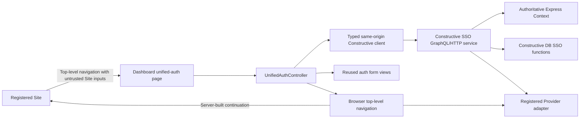
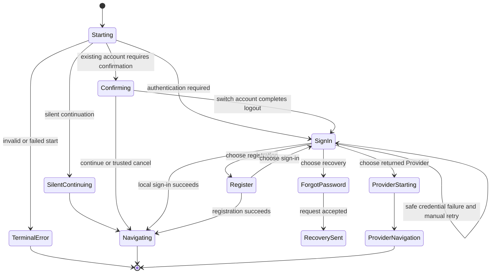
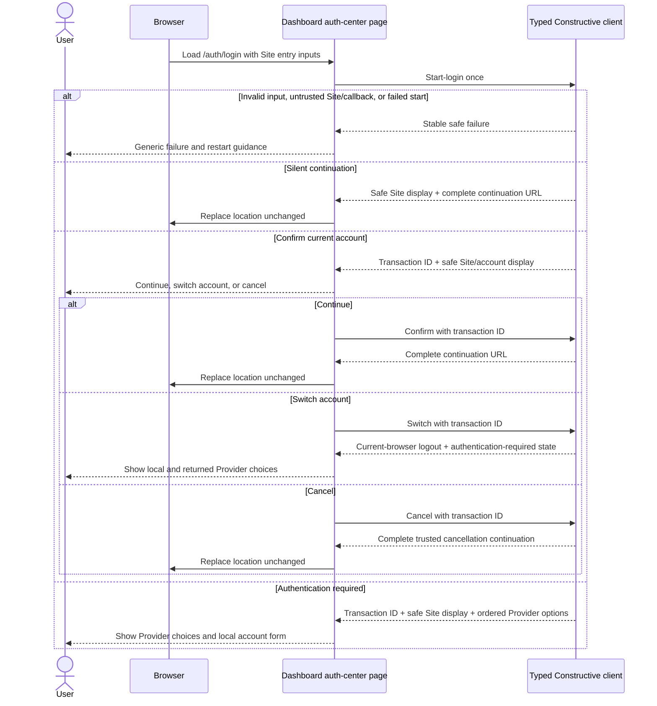

# OAuth/SSO Platform Integration — Dashboard Unified Authentication UI Detailed Design

## Document Status

This document is the implementation-oriented design for the unified authentication UI hosted by Dashboard. It derives product behavior from [OAuth and Cross-Domain SSO Requirements](../plan/oauth-sso-platform-integration.md), protocol and trust boundaries from [OAuth/SSO Platform Integration Technical Specification](oauth-sso-platform-integration.md), and server contracts from [Constructive Detailed Design](oauth-sso-platform-integration-constructive-design.md).

The verified Dashboard code baseline is remote `main` commit `892c85e491ff8acfe8a267c3bb3487b2488223c6` from 2026-08-06. Current implementation evidence is Dashboard commit `a6611fbcab677e91c431f275bd02930b39828421` against Constructive stack head `87061435f59a1410b19161c2ae2365cc0891da5d` and Constructive DB runtime `ffc87bb07ede49a0734f676d0eb06042f0565eef`. Any later contract change must freeze the replacement SHAs and regenerate the typed GraphQL artifacts before compatibility conclusions are drawn.

This design distinguishes confirmed cross-system behavior from three remaining low-level product presentation choices in [Open Presentation Decisions](#open-presentation-decisions). Those choices do not change the trust, transaction, Provider-discovery, or handoff architecture.

## Scope

This design covers:

- the Dashboard-hosted unified authentication entry;
- isolation from Dashboard management features and management authentication;
- start-login orchestration and the silent, confirm, and authentication-required decisions;
- reuse of the existing Tenant/database authentication presentation components;
- local email/password sign-in, registration, and password recovery presentation;
- configuration-driven external Identity Provider buttons;
- authentication-center Bearer/Cookie handling;
- safe navigation to Constructive Provider authorization and Site continuations;
- account confirmation, cancellation, and switching;
- branding, error presentation, accessibility, responsive behavior, testing, and rollout.

## Non-Goals

- Site/callback, Tenant, database, SSO-group, or `returnTo` validation in Dashboard.
- OAuth state, PKCE, Provider endpoint, token, callback, or identity-association logic.
- Handoff construction, inspection, redemption, or Site-local credential issuance.
- Site administration, Provider administration, or other Dashboard management UI.
- A fixed frontend Provider allowlist or Provider-specific top-level page workflow.
- Transaction recovery, polling, refresh restoration, or cross-tab transaction sharing.
- Cross-parent-domain Cookie sharing, third-party Cookie dependence, or browser SSO when all first-party Cookies are disabled.
- Strict-auth, local MFA, or step-up integration.
- New Dashboard Playwright infrastructure or Hub cross-host E2E in the Dashboard PR.

## Confirmed UI Boundaries

1. Dashboard is the presentation host. Constructive owns every security decision and server-side state transition.
2. The unified authentication capability is independent of Dashboard organization, database-management, schema-builder, chatbot, and administration features.
3. The browser enters on the current Tenant's canonical authentication origin. Dashboard never accepts or selects a Tenant/database independently of that routed Host.
4. Dashboard sends the untrusted Site entry inputs to start-login exactly once for the active page flow. Constructive returns the trusted safe display and decision context.
5. The opaque unified login transaction ID remains in page memory and is supplied only to Constructive operations during the active flow. It is never written to a URL or persistent browser storage.
6. Existing unified authentication follows the server's effective silent or confirm decision. Dashboard cannot request silent mode.
7. Local sign-in, local registration, reused authentication, and every external Provider converge on the same server-owned continuation contract.
8. Registration success immediately establishes authentication-center state and continues the Site login flow without an email-verification gate.
9. Provider availability is not fixed by Dashboard or a release-specific frontend list. Dashboard renders the ordered safe Provider options returned for the current Tenant.
10. A successful Dashboard-mediated branch receives one complete server-built continuation URL and assigns browser location without parsing, rebuilding, or appending values.
11. Provider callback success navigates from Constructive directly to the exact Site callback; Dashboard is not inserted into that success response.
12. An interrupted, refreshed, expired, or failed Provider flow is not resumed. The user restarts from the Site login entry.

## Verified Dashboard Baseline and Required Evolution

| Area                     | Current Dashboard baseline                                                                                                                               | Unified-auth decision                                                                                                                         |
| ------------------------ | -------------------------------------------------------------------------------------------------------------------------------------------------------- | --------------------------------------------------------------------------------------------------------------------------------------------- |
| Tenant login container   | `components/auth/auth-embedded.tsx` switches among login, registration, password recovery, and reset and selects Tenant/database forms                   | Reuse its presentation pattern, not its management/database orchestration                                                                     |
| Form views               | `LoginFormView`, `RegisterFormView`, `ForgotPasswordFormView`, and `ResetPasswordFormView` own accessible fields, validation, loading, and inline errors | Reuse or narrowly extend these views through callbacks and composition                                                                        |
| Tenant login controllers | `DashboardLoginForm` and related wrappers call per-database hooks and redirect to `/db/:id/data`                                                         | Replace with unified-auth controllers that carry the active transaction and consume server continuation results                               |
| Registration behavior    | `useRegisterDashboard` signs up directly without the schema-builder email-verification redirect                                                          | Preserve the direct-authentication behavior through the new SSO registration operation; do not reuse the schema-builder controller            |
| Management registration  | `useRegisterSb` checks membership verification, sends verification email, and redirects to `check-email`                                                 | Do not use this controller in unified authentication                                                                                          |
| Routes                   | `/login`, `/register`, and recovery routes are management `guest-only` routes                                                                            | Add public auth-center routes that remain usable with an existing unified session and never redirect merely because the user is authenticated |
| Root runtime             | Root layout mounts management authentication, schema-builder data, shell, stack, and chatbot providers                                                   | Give auth-center routes a minimal runtime that does not require or initialize management capabilities                                         |
| Token storage            | `TokenManager` supports `schema-builder` and database-scoped `dashboard` keys with local/session storage and cross-tab invalidation                      | Reuse/generalize its storage lifecycle under an explicit auth-center namespace; never reuse a management or Site token slot                   |
| GraphQL clients          | Existing generated auth SDK targets management/control-plane auth while dynamic database hooks use `executeInContext`                                    | Generate or use the correct Tenant-auth GraphQL target after the Constructive schema freezes; do not hand-maintain a parallel untyped API     |
| Error UI                 | `parseGraphQLError` maps known canonical codes and hides technical network messages                                                                      | Extend the owned mapping for canonical SSO/OAuth codes; never display raw Provider or internal errors                                         |
| Branding                 | Existing auth screen components accept a logo and application name                                                                                       | Render the safe Site display context and constrained theme returned by start-login                                                            |
| Tests                    | Vitest, Testing Library, Storybook, and Storybook a11y are present; Dashboard has no owned Playwright suite                                              | Use existing unit/component/story infrastructure; leave real cross-host browser E2E to the owning Hub/Site integration                        |
| Localization             | Application auth copy is currently English and no app-level translation framework is present                                                             | Keep copy centralized; the initial language choice remains a presentation decision rather than an ad hoc new i18n framework                   |

## Component and Trust Map



Dashboard owns only:

- rendering safe Site/account/Provider context;
- collecting local credentials and explicit user choices;
- keeping ephemeral page state;
- invoking typed Constructive operations; and
- performing approved top-level navigation.

Dashboard never owns:

- trust in a Site ID, callback, Host, `returnTo`, or `site_state`;
- the effective sign-in mode or reusable-session decision;
- Provider support, endpoint, secret, state, PKCE, or token processing;
- identity matching/provisioning;
- handoff contents or Site-local credential creation.

## Route and Runtime Isolation

### Public Route Surface

The Dashboard PR should establish these implementation routes unless the frozen deployment contract selects equivalent names before coding:

| Route                  | Purpose                                                                 | Access                                                  |
| ---------------------- | ----------------------------------------------------------------------- | ------------------------------------------------------- |
| `/auth/login`          | Unified login entry and active-flow UI                                  | Public, with or without an existing auth-center session |
| `/auth/error`          | Safe terminal failure from Constructive or local start failure          | Public; accepts only a stable safe error code           |
| `/auth/reset-password` | Existing password-reset completion outside the active login transaction | Public                                                  |

The management routes `/login`, `/register`, `/forgot-password`, `/reset-password`, `/check-email`, and `/verify-email` retain their existing behavior. Unified authentication does not overload their route guards or controllers.

### Minimal Auth-Center Runtime

The auth-center route group must render without:

- `AuthenticatedShell`;
- organization/database/schema-builder data providers;
- Dashboard database selection;
- chatbot, command palette, management stack, or management navigation;
- management route guards;
- Direct Connect or user-configurable endpoint overrides; or
- management-token injection.

The common root may retain fonts, validated runtime bootstrapping, theme primitives, a query client, and the portal/toast primitives actually required by the auth UI. Management-only providers move behind a management route boundary or are lazily selected so visiting `/auth/*` does not initialize or depend on them.

The implementing PR should isolate any mechanical route-group/layout movement from behavioral auth changes so the human review remains readable.

### Same-Origin Constructive Client

Auth-center operations use the current Tenant authentication origin's Constructive GraphQL/HTTP surface. The client:

- uses a relative or otherwise server-approved same-origin endpoint;
- sends first-party Cookies through the existing request mode;
- adds only the auth-center Bearer token when one exists;
- never accepts a UI endpoint override;
- never sends a schema-builder, per-database Dashboard, or Site-local token;
- uses the generated typed operation surface selected after the Constructive schema freezes; and
- disables automatic mutation retry for transaction-changing operations.

No new Dashboard environment variable is required merely to select Tenant, database, Site, Provider, callback, or redirect behavior. Those values come from routed server context and safe API results, not browser configuration.

## Entry Input and URL Lifecycle

The Site navigates the browser to `/auth/login` with the logical entry values already defined by the formal Spec:

- Site identifier;
- optional exact callback;
- optional Site-internal application-relative `returnTo`; and
- Site-generated `site_state`.

These query values are untrusted start inputs, not Dashboard configuration. The page:

1. parses only the expected scalar values and rejects duplicate/structurally invalid query shapes locally;
2. invokes start-login once without inferring Tenant, callback trust, or `returnTo` safety;
3. performs no automatic retry after an ambiguous transport failure;
4. after a successful start response, replaces the visible URL with the clean `/auth/login` route; and
5. keeps only the returned opaque transaction ID and safe display/decision context in memory.

The initial document and route use `Referrer-Policy: no-referrer` and no-store behavior. Dashboard access, analytics, and error logging redact the callback, `returnTo`, `site_state`, transaction ID, and any future approved one-time auth artifact.

If page refresh or browser history loses the in-memory transaction, Dashboard does not call a transaction-status query. It presents the safe restart instruction and directs the user to begin again from the Site.

## Typed Client Contract

The exact GraphQL field and generated type names follow the frozen Constructive schema. Dashboard consumes the following logical discriminated results rather than private DB rows.

### Start Result

```ts
type SafeSiteDisplay = {
  displayName: string;
  verifiedHost: string;
  iconRef?: string | null;
  accentColor?: string | null;
};

type SafeAccountDisplay = {
  displayName: string;
  avatarRef?: string | null;
};

type ProviderDisplayOption = {
  key: string;
  displayName: string;
  iconKey?: string | null;
};

type UnifiedAuthStartResult =
  | {
      decision: 'SILENT_CONTINUE';
      site: SafeSiteDisplay;
      continuationUrl: string;
    }
  | {
      decision: 'CONFIRM_ACCOUNT';
      transactionId: string;
      site: SafeSiteDisplay;
      account: SafeAccountDisplay;
    }
  | {
      decision: 'AUTHENTICATION_REQUIRED';
      transactionId: string;
      site: SafeSiteDisplay;
      providers: ProviderDisplayOption[];
    };
```

This is a Dashboard consumer contract, not a requirement that the GraphQL schema use TypeScript union names verbatim. It expresses these invariants:

- silent completion gives Dashboard one opaque navigation target, not handoff parts;
- account confirmation gets only safe identity display data;
- authentication-required gets the active transaction and the ordered Provider options;
- callback, SSO group, database, secret, endpoint, raw `returnTo`, and handoff internals are absent.

### Action Results

Logical active-flow actions are:

| Action                  | Input                                           | Safe result                                                                                          |
| ----------------------- | ----------------------------------------------- | ---------------------------------------------------------------------------------------------------- |
| Confirm current account | Transaction ID                                  | Complete server-built continuation URL                                                               |
| Cancel                  | Transaction ID                                  | Complete trusted Site cancellation URL or terminal safe result selected by Constructive              |
| Switch account          | Transaction ID                                  | Authentication-required state after current-browser unified logout, plus fresh safe Provider options |
| Local sign-in           | Transaction ID plus existing local credentials  | Normal auth-center credential result plus complete continuation URL                                  |
| Local registration      | Transaction ID plus existing registration input | Normal auth-center credential result plus complete continuation URL                                  |
| Start Provider          | Transaction ID plus Provider key                | Same-origin Constructive authorization-initiation URL only                                           |

Dashboard never accepts decomposed callback, handoff, `site_state`, SSO group, or `returnTo` fields in an action result.

## Page State Machine

Use one reducer or equivalent explicit state machine rather than a collection of unrelated booleans.

```ts
type UnifiedAuthViewState =
  | { status: 'starting' }
  | { status: 'silent-continuing'; site: SafeSiteDisplay }
  | {
      status: 'confirming';
      transactionId: string;
      site: SafeSiteDisplay;
      account: SafeAccountDisplay;
    }
  | {
      status: 'sign-in';
      transactionId: string;
      site: SafeSiteDisplay;
      providers: ProviderDisplayOption[];
    }
  | {
      status: 'register';
      transactionId: string;
      site: SafeSiteDisplay;
      providers: ProviderDisplayOption[];
    }
  | { status: 'forgot-password'; site: SafeSiteDisplay }
  | { status: 'recovery-sent'; site: SafeSiteDisplay }
  | {
      status: 'provider-starting';
      transactionId: string;
      site: SafeSiteDisplay;
      selectedProvider: string;
    }
  | { status: 'continuing'; site: SafeSiteDisplay }
  | { status: 'terminal-error'; errorCode?: string };
```



State rules:

- at most one mutation is active at a time;
- the initiating button alone shows the relevant spinner when possible;
- duplicate submission is disabled until the operation settles;
- local credential failure returns to the same form and permits manual retry while the transaction remains active;
- transaction, boundary, and Provider failures do not silently fall back to another branch;
- no state transition reconstructs a trusted URL or infers a Provider list.

## Main UI Flows

### Start, Silent, and Confirm



The initial loading state is neutral and does not flash a credential form before Constructive returns the decision. Silent mode does not show the account confirmation card. It still executes the same start validation and shared completion path.

### Local Sign-In and Registration

```mermaid
sequenceDiagram
    actor U as User
    participant D as Dashboard auth-center page
    participant C as Typed Constructive client
    participant T as Auth-center token storage
    participant B as Browser

    U->>D: Submit local credentials or registration
    D->>C: SSO operation with active transaction
    alt Safe credential or validation failure
        C-->>D: Canonical safe error
        D-->>U: Inline message; manual correction/resubmit
    else Success
        C-->>D: Auth-center Bearer outcome + complete continuation URL
        D->>T: Store auth-center Bearer according to persistence choice
        Note over C,B: Existing first-party HttpOnly Cookie behavior is owned by Constructive response
        D->>B: Assign complete continuation URL unchanged
    end
```

The reused form views keep current field semantics, password-manager-friendly autocomplete, validation, and loading behavior. The new controllers:

- call SSO-specific typed operations rather than `useLoginDashboard`, `useRegisterDashboard`, or `useRegisterSb`;
- pass the active transaction ID only to Constructive;
- do not redirect to `/db/:id/data`, the management home, or `check-email`;
- preserve the existing safe local-password error outcome;
- perform no automatic password retry; and
- treat successful registration as authenticated completion immediately.

### Password Recovery

Password recovery reuses the existing Tenant-local recovery operation and form presentation, but it does not resume the active unified login transaction.

- Entering recovery abandons the UI's active transaction reference.
- The request result remains enumeration-safe.
- The email opens `/auth/reset-password` with the existing reset proof expected by Constructive.
- The reset page does not accept or restore a unified transaction ID.
- After successful reset, Dashboard tells the user to return to the originating Site and start login again.
- Dashboard does not create a convenience continuation containing the old Site, callback, or `returnTo`.

### External Provider Start

```mermaid
sequenceDiagram
    actor U as User
    participant D as Dashboard auth-center page
    participant C as Typed Constructive client
    participant B as Browser
    participant A as Constructive OAuth route
    participant P as Configured external Provider

    U->>D: Choose a returned Provider option
    D->>C: Provider-start with transaction ID + Provider key
    C-->>D: Same-origin authorization URL
    D->>B: Top-level navigation to returned URL
    B->>A: Authorization initiation with opaque OAuth state
    A-->>B: Redirect to selected registered Provider adapter flow
    B->>P: Provider authorization
    P-->>A: Callback with code/error + OAuth state
    alt Provider success
        A-->>B: Direct Site continuation; Dashboard not re-entered
    else Safe Provider failure
        A-->>B: Dashboard /auth/error with stable safe code only
        B->>D: Render failure and restart guidance
    end
```

Dashboard never:

- sends the unified transaction ID to a Provider;
- constructs an OAuth authorize URL;
- handles Provider authorization code, state, verifier, token, or profile data;
- opens a Provider popup or attempts cross-window state synchronization; or
- resumes a failed Provider branch.

## Provider Discovery and Button Design

### Availability Contract

Provider options are returned by Constructive after combining:

1. server OAuth enablement;
2. adapters registered in the running server;
3. the current Tenant database's enabled Provider rows;
4. complete validated Provider configuration and secret resolution; and
5. the mandatory adapter security policy.

The Dashboard page has no Google/GitHub/Facebook/LinkedIn or other availability constant. Google and GitHub may appear in adapter-specific tests and assets, but they do not define a v1 UI allowlist. A synthetic supported Provider used in a Dashboard test must render without changing the page controller.

The current `identityProviders` loader already exposes a Tenant-configured `displayName`; it does not expose an icon or display-order field. The public DTO therefore uses:

- `key` from the selected registered Provider identity;
- `displayName` from safe Tenant configuration, falling back server-side to a safe registry name;
- optional `iconKey` from approved server registry metadata, never arbitrary HTML/SVG or an unvalidated remote asset URL; and
- array order selected deterministically by Constructive.

Dashboard renders the returned order exactly and does not sort by a hard-coded Provider priority. Until a separately confirmed Tenant-controlled order exists, Constructive may use stable `displayName` then `key` ordering without adding a DB field.

### Button Presentation

When one or more Provider options exist:

- render one full-width, neutral outline button per returned option above the local email/password form;
- use `Continue with {displayName}` as accessible visible text;
- render the approved local icon for `iconKey`, with a generic identity icon fallback;
- never hide or disable a valid unknown key merely because Dashboard lacks a branded icon;
- keep Provider buttons in a vertical list so labels remain readable and every option stays visible;
- render an `or continue with email` separator before the local form;
- show progress only on the selected Provider button and block duplicate starts; and
- submit only the opaque transaction ID and selected Provider key.

When the Provider array is empty, omit both the Provider region and its separator. The Constructive account/password, registration, and recovery options remain present.

Tenant branding and Provider branding are separate. The Site accent color may style the primary local action and focus token, but it does not recolor Provider logos or turn database text into trusted Provider artwork.

## Tenant Login UI Reuse

### Reuse Directly or with Narrow Props

- `AuthScreenLayout` for the responsive card and legal footer.
- `AuthScreenHeader` for constrained Site/Constructive branding.
- `LoginFormView` for email/password, remember-me presentation, password-manager attributes, validation, and inline errors.
- `RegisterFormView` for email/password confirmation and existing validation.
- `ForgotPasswordFormView` and `ResetPasswordFormView` for recovery presentation.
- `AuthErrorAlert`, `AuthLoadingButton`, `FormField`, and `PasswordStrength`.

### Extract or Add

- `UnifiedAuthController` for start and active transaction state.
- `UnifiedAuthProviderButtons` for configuration-driven Provider actions.
- `UnifiedAuthConfirmAccount` for safe account display and continue/switch/cancel.
- `UnifiedAuthSafeError` for terminal restart-only failures.
- `UnifiedAuthBranding` for safe Site name, verified host, icon, accent token, and fixed Constructive identity.
- typed unified-auth hooks and a small navigation helper that accepts only a complete server result.
- a pure reducer and canonical error-to-view mapper.

### Do Not Reuse

- `AuthEmbedded` database selection, `useDashboardContext`, or service-error UI;
- `DashboardLoginForm` redirect behavior;
- `useLoginDashboard` or database-scoped token selection;
- `useRegisterSb` email-verification redirect;
- management `RouteGuard` guest-only behavior;
- Direct Connect endpoint overrides; or
- any existing controller that chooses a database or post-login management route.

## Branding and Visual Rules

The start result supplies only safe public branding. The page displays:

- the Site display name;
- the verified registered Site hostname;
- an optional platform-approved Site icon;
- an optional validated accent color; and
- a fixed, low-key Constructive identity.

The account confirmation view displays only the safe account name and optional avatar with Continue, Switch account, and Cancel. It does not display permissions, scopes, callback URLs, database names, Provider secrets, or technical transaction facts.

Dashboard does not render arbitrary Tenant HTML, Markdown, CSS, fonts, scripts, data URLs, inline SVG, or unapproved remote branding URLs. Missing or invalid display metadata falls back to Constructive defaults without changing the authentication decision.

The accent color is applied through a narrow CSS custom property or theme token with contrast enforcement. It cannot replace destructive/error colors or weaken focus visibility.

## Authentication-Center Credential Handling

The auth-center Host is a separate first-party origin and therefore a separate browser credential boundary. Dashboard should reuse and generalize the current Token Manager lifecycle under an explicit auth-center namespace, for example:

```text
constructive-auth-token:auth-center
constructive-remember-me:auth-center
```

The Tenant-scoped Host already isolates these keys by browser origin; the key must not contain a browser-selected Tenant ID.

Rules:

- Constructive owns the host-only `Secure`, `HttpOnly` first-party Cookie.
- Dashboard may store the returned auth-center Bearer in localStorage or sessionStorage according to the confirmed persistence choice.
- The GraphQL client sends Bearer when available while retaining first-party Cookie behavior; Constructive preserves Bearer precedence.
- Auth-center logout and switch clear the auth-center Bearer only. They do not delete management or arbitrary Site storage.
- Transaction IDs, Provider data, handoff, callback, `site_state`, and `returnTo` never enter token storage.
- Storage logging never includes the Bearer value.
- If browser token storage is unavailable but Constructive confirms the first-party Cookie/session outcome, the current browser flow may continue using the Cookie. If neither local credential mode is usable, the UI fails explicitly rather than pretending persistent SSO exists.

Cross-tab token invalidation may reuse the current storage-event pattern. Active transaction state remains tab-local and is never synchronized.

## Navigation Contract

One helper owns successful Dashboard navigation:

```ts
function navigateToServerContinuation(url: string): void;
```

It accepts only a URL field from a successful typed Constructive result and performs top-level location assignment. It does not:

- parse query parameters;
- inspect the handoff;
- append Site or `returnTo` values;
- normalize or resolve a relative target against browser input;
- log the URL; or
- send it through client-side Next.js routing or prefetch.

Provider start uses the same pattern with the returned same-origin Constructive authorization URL. The typed response category, not URL string inspection, determines which helper call is valid.

## Error Presentation

Extend the existing owned auth-error mapping rather than creating a separate error system. The mapper consumes stable canonical error codes and produces a safe UI category:

| Category                     | Examples                                                                        | Dashboard behavior                                                          |
| ---------------------------- | ------------------------------------------------------------------------------- | --------------------------------------------------------------------------- |
| Correctable local input      | Invalid credentials, password policy, existing account                          | Inline form message; retain non-secret fields and allow deliberate resubmit |
| Transaction/boundary failure | Invalid Site/callback/`site_state`, expired or used transaction                 | Terminal generic page; do not navigate to an untrusted target               |
| Provider failure             | Cancel, invalid OAuth state/PKCE, verification, configuration, account conflict | Safe auth-center failure; tell user to restart from Site                    |
| Network uncertainty          | Start/action response not known                                                 | No automatic mutation retry; show restart guidance                          |
| Internal/unknown             | Unregistered or technical failure                                               | Generic failure plus safe correlation/request ID when supplied              |

Raw GraphQL messages, Provider `error_description`, URLs, callback values, email ownership details, SQL, stack traces, and tokens never appear in the page. Unknown codes fall back to the generic internal message; they are not displayed verbatim.

After reading a stable safe error code from `/auth/error`, the page replaces the URL with the clean error route. The failure page has no same-transaction Retry button. It may offer only a neutral instruction to return to the Site and restart.

## Security and Privacy

- Auth-center routes use `Cache-Control: no-store` and `Referrer-Policy: no-referrer`.
- CSP forbids unapproved script, frame, and asset origins; the login page cannot be embedded by an arbitrary Site.
- No third-party analytics, support widget, chatbot, or marketing pixel runs on auth-center routes.
- Site and Provider labels render as React text, never HTML.
- Password fields use correct `autocomplete` values and never copy credentials into React Query cache, logs, analytics, or persistent application state.
- Mutations have automatic retry disabled. React Strict Mode and remount behavior must not issue duplicate start mutations; one guarded start invocation owns the mounted entry.
- Continuation and Provider authorization use top-level browser navigation, not popups, iframes, fragments, or cross-window messages.
- The page does not inspect or persist the handoff code because Dashboard-mediated completion receives only the opaque full continuation URL.
- All sensitive query names and values are redacted from Dashboard request, access, APM, client logger, and error-reporting paths.
- The auth-center endpoint cannot be overridden through persisted Dashboard settings or Direct Connect.

## Accessibility and Responsive Behavior

- Use semantic headings, labels, forms, and buttons; do not express state only through icons or color.
- Move focus to the new screen heading or first invalid field after a state transition.
- Announce inline and terminal errors through the existing accessible alert pattern.
- Preserve keyboard submission and navigation for every Provider and local action.
- Provider buttons always expose their complete display name to assistive technology.
- Loading indicators have accessible names and buttons retain stable dimensions.
- Respect reduced-motion preferences; transitions never delay navigation or authentication.
- The card remains usable at narrow mobile widths, large text zoom, and keyboard viewport sizes.
- Site icon/avatar failures use silent visual fallbacks without changing text identity.
- Theme accents must pass contrast checks against both supported Dashboard themes.

## Test Design

### Pure State and Mapping Tests

Use Vitest for:

- start-result discriminated-state transitions;
- transaction ID never entering serializable/persisted state;
- safe error-code mapping and unknown-code fallback;
- Provider option rendering data independent of Provider names;
- complete continuation navigation accepting only typed success results;
- no automatic retry decisions; and
- URL cleanup/redaction helpers.

### Component and Hook Tests

Use Testing Library with the existing Dashboard test setup. Mock the typed Constructive transport, not Provider protocols or private DB state. Cover:

- neutral starting state with no credential-form flash;
- silent continuation;
- confirm, continue, cancel, and switch-account behavior;
- dynamic zero/one/many Provider arrays;
- a fabricated registered Provider key with no branded icon, proving no frontend allowlist;
- server-provided Provider ordering and generic icon fallback;
- selected-Provider loading and duplicate-submit prevention;
- local password safe failure/manual retry and success continuation;
- registration success without check-email navigation;
- recovery abandoning the transaction and reset requiring a fresh Site start;
- auth-center token namespace separation from schema-builder and database Dashboard tokens;
- no management provider, shell, chatbot, or endpoint override on `/auth/*`;
- terminal transaction/Provider failure with no same-flow resume; and
- sensitive values absent from rendered output and logger mocks.

### Storybook and Accessibility

Add stories for:

- starting;
- no Providers;
- several configuration-driven Providers;
- unknown icon fallback;
- account confirmation with and without avatar;
- local sign-in/registration/recovery;
- inline local error;
- terminal safe error; and
- long names, narrow viewport, dark/light theme, and reduced motion.

Run the existing Storybook a11y addon on these stories. Do not create Provider-specific stories as the only coverage of the generic list.

### Browser and Cross-System Coverage

The Dashboard PR does not introduce a standalone OAuth simulator or Playwright framework. Constructive server integration tests own GraphQL/HTTP/Cookie/redirect behavior with external Providers mocked. The later Hub/Site integration owns real cross-parent-domain browser navigation, exact callback, handoff redemption, Site Cookie, account switching, and shared-session rejection.

Dashboard acceptance at that layer is observable only through its public seams:

- correct start/action calls;
- correct first-party credential behavior;
- top-level navigation to the exact server result; and
- no token, transaction, handoff, or raw Provider data exposed by the UI.

## Proposed File and Package Inventory

The actual PR reconciles these paths with the frozen Dashboard tree and avoids editing generated SDK files by hand.

| Owner                                                               | Expected change                                                                               |
| ------------------------------------------------------------------- | --------------------------------------------------------------------------------------------- |
| `apps/admin/src/app/(auth-center)/auth/login/page.tsx`              | Public unified-auth entry page                                                                |
| `apps/admin/src/app/(auth-center)/auth/error/page.tsx`              | Stable safe failure page                                                                      |
| `apps/admin/src/app/(auth-center)/auth/reset-password/page.tsx`     | Existing recovery completion in auth-center runtime                                           |
| auth-center and management layouts                                  | Minimal auth runtime and isolation from management providers/shell                            |
| `apps/admin/src/app-routes.ts`                                      | Public auth-center route declarations with shell bypass                                       |
| `apps/admin/src/components/auth/unified/`                           | Controller, Provider buttons, confirmation, branding, and safe-error views                    |
| existing `apps/admin/src/components/auth/*-form-view.tsx`           | Narrow compositional props only where existing views cannot be reused unchanged               |
| `apps/admin/src/lib/gql/hooks/auth/unified/`                        | Typed start, confirm, cancel, switch, local, registration, recovery, and Provider-start hooks |
| generated auth SDK target                                           | Regenerated from the frozen Constructive schema; no manual generated edits                    |
| `apps/admin/src/lib/auth/token-manager.ts` and auth store selectors | Reuse/generalize the lifecycle for explicit auth-center credential namespace                  |
| `apps/admin/src/lib/auth/auth-errors.ts`                            | Canonical SSO/OAuth code-to-copy mappings through the existing parser                         |
| `apps/admin/src/stories/auth/`                                      | Unified-auth state stories and a11y cases                                                     |
| colocated `__tests__`                                               | Reducer, hook, component, route isolation, token separation, and navigation tests             |

No OAuth environment parser, Provider endpoint configuration, transaction cache, callback parser, or handoff utility belongs in Dashboard.

## Incremental PR Plan

1. **Route/runtime isolation and reusable presentation**
   - minimal auth-center layout;
   - management route behavior unchanged;
   - controller reducer and mocked state stories;
   - focused route-isolation tests.
2. **Typed start and existing-authentication decisions**
   - generated client integration after Constructive schema pin;
   - start input lifecycle and URL cleanup;
   - silent/confirm/authentication-required states;
   - branding and canonical errors.
3. **Local account and credential integration**
   - SSO local sign-in and registration hooks;
   - auth-center token namespace and existing Cookie behavior;
   - password recovery/reset separation;
   - local form and storage tests.
4. **Configuration-driven Provider UI**
   - ordered generic Provider buttons and icons/fallback;
   - Provider-start top-level navigation;
   - safe Provider failure page;
   - tests with known and fabricated Provider keys.
5. **Switch/cancel, hardening, and cross-system readiness**
   - current-browser switch behavior and cancellation;
   - accessibility, security headers, URL/log redaction, long-label/responsive cases;
   - final typed integration against pinned Constructive;
   - handoff to Hub/Site browser E2E owner.

Each PR should keep generated code changes separate or clearly identified, remove pure formatting churn, and avoid bundling unrelated Dashboard management refactors.

## Rollout and Compatibility

- Existing management and per-database Tenant login pages continue to work unchanged while the auth-center route is introduced.
- The new page is enabled only after the pinned Constructive endpoint exposes the required typed operations and safe DTOs.
- Sites begin using the unified entry only after their Site/callback configuration and Tenant auth Host are active.
- No legacy `/auth/providers`, browser OAuth-state Cookie, fragment token, shared-parent Cookie, or management-login fallback is added.
- If the running server returns no Providers, local account/password, registration, and recovery remain available.
- A Provider added later through the server adapter registry and complete Tenant configuration appears without a Dashboard workflow or availability-list change.

## Open Presentation Decisions

These do not alter server trust or protocol behavior and may be confirmed before the Dashboard UI PR is finalized:

1. **Remember-me default.** Recommendation: keep the existing visible choice and current default-on behavior, while the server remains the maximum-lifetime authority. Unchecked uses session storage; checked uses local storage.
2. **Switch-account warning.** Recommendation: show one concise confirmation because switching revokes account A across this browser's bound Sites, then continue the current transaction with account choices.
3. **Initial language.** Recommendation: ship the current English experience with all auth-center copy centralized; do not introduce a new application-wide i18n framework inside this feature PR.

Provider availability, Provider ordering ownership, unknown-icon fallback, Tenant-login-view reuse, and the absence of a fixed Provider allowlist are resolved by this design and are not open presentation decisions.

## Acceptance Criteria

The Dashboard unified-authentication UI is complete when:

1. `/auth/*` runs without management authentication, database selection, management data providers, shell, chatbot, or endpoint overrides.
2. start-login runs once from the Tenant auth Host, cleans initial query data after success, and keeps the opaque transaction ID only in memory.
3. silent, confirm, and authentication-required decisions come only from Constructive and render without branch guessing or credential-form flash.
4. the confirmation view shows only safe Site/account identity and implements continue, switch, and cancel through typed Constructive operations.
5. local sign-in reuses existing form behavior, permits deliberate manual retry, and follows only the complete server continuation on success.
6. local registration authenticates and continues immediately without the management email-verification flow.
7. password recovery/reset uses existing Tenant operations and never restores or resumes an old transaction.
8. Provider buttons render from the ordered server array with no fixed frontend Provider list, support unknown keys through a generic icon, and disappear cleanly when the list is empty.
9. Provider start sends only transaction ID plus selected key to Constructive and performs top-level navigation to the returned same-origin URL.
10. no Dashboard code receives or processes Provider state/code/token/profile, handoff parts, callback trust, SSO group, raw `returnTo`, or Site-local credentials.
11. auth-center Bearer/Cookie handling is isolated from management and Site credentials; no credential or transaction is logged.
12. stable canonical failures map to safe accessible copy; unknown/internal failures remain generic; failed Provider/transaction flows require a fresh Site start.
13. all continuation navigation uses the complete typed server result unchanged, with no client reconstruction or Next.js prefetch.
14. Vitest/Testing Library and Storybook cover the state machine, dynamic Providers, local flows, branding, errors, token separation, accessibility, and sensitive-data absence.
15. the implementation introduces no parallel Provider registry, transaction store, error system, environment parser, or browser OAuth/handoff protocol.
