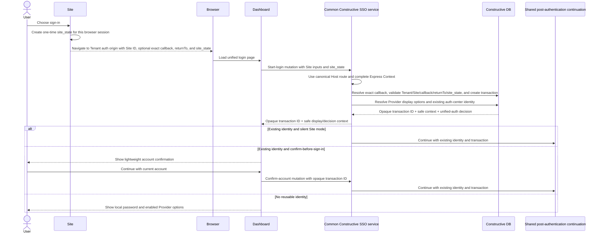
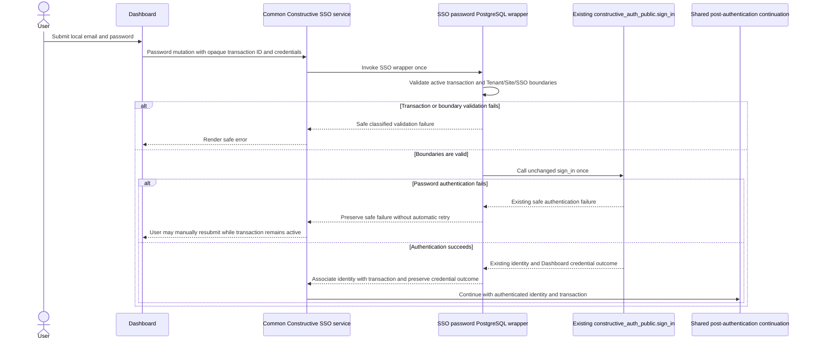
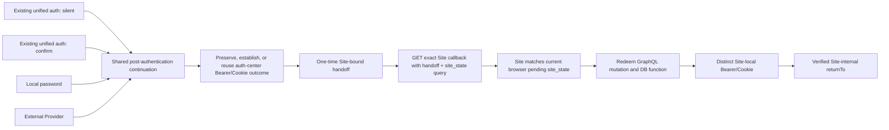

# OAuth/SSO Platform Integration Technical Specification

## Document Status

This document is the technical design specification for the unified authentication center. It records confirmed design decisions; unresolved proposals remain in the adjacent working draft until they are explicitly confirmed.

## Product Requirements Source

The product requirements and expected user-visible behavior are defined in [`docs/sso/plan/oauth-sso-platform-integration.md`](../plan/oauth-sso-platform-integration.md). This specification describes how those requirements are implemented without redefining them.

Working proposals, suggested values, evidence, and unresolved alternatives belong in the adjacent [working draft](./oauth-sso-platform-integration-draft.md). Only confirmed decisions should be promoted into this document.

## Implementation Designs

The component-level implementation designs derive from this specification:

- [Constructive DB detailed design](./oauth-sso-platform-integration-constructive-db-design.md)
- [Constructive detailed design](./oauth-sso-platform-integration-constructive-design.md)
- [Dashboard unified-authentication UI detailed design](./oauth-sso-platform-integration-dashboard-design.md)

## Goals and Scope

- Integrate external Providers through one protocol-neutral adapter boundary rather than duplicating the unified-login workflow per Provider.
- Reuse the existing Constructive identity association and provisioning capabilities.
- Make every successful authentication method converge on one Site handoff and local-credential completion path.
- Keep Sites or flows requiring Constructive `strictAuth`, local MFA, or step-up authentication outside v1 SSO integration. Their future integration requires a separate design based on a real use case and must never downgrade or bypass the existing policy.

## Public Concepts and Trust Boundaries

### Roles and Ownership

- Dashboard owns authentication-center presentation and sends the active unified login transaction identifier only to Constructive.
- Constructive owns generic SSO orchestration, OAuth authorization-request state, Provider adapter selection, normalized identity consumption, and transition into shared post-authentication completion.
- Provider Adapters own Provider-specific authorization and callback/code-to-normalized-identity behavior. Common login-transaction validation, account matching or provisioning, and shared handoff orchestration remain in Constructive; the adapter contract and concrete Google/GitHub examples are detailed in [Main Login 3](#main-login-3-external-provider). Those examples are not a release-specific Provider allowlist.
- Constructive DB owns durable identity association and the existing identity procedures. The browser and external Provider are outside the trusted transaction boundary.
- The current Express Context remains the only request-level source for resolved Tenant, API, database, route, session, user, and request facts. Common orchestration uses its existing `authSurface` and `identityProviders` loaders for authentication-procedure discovery, enabled Tenant-scoped Provider configuration, and internal-secret resolution; it does not introduce parallel auth contexts or loaders.
- v1 exposes the unified-authentication UI and Constructive endpoints through a Tenant-scoped authentication origin registered in the existing canonical Host routing plane. The resolved Host and full Express Context establish the Tenant/API/database boundary before any SSO operation; no handler accepts a browser-selected Tenant/database or scans another Tenant's state. Each authentication-center session Cookie is host-only to that Tenant origin.
- Provider adapters receive the already selected and validated Provider configuration from common orchestration. They do not read environment variables, query Provider configuration or secrets directly from the database, infer Tenant or route facts, or implement legacy Tenant, secret, schema, or database-version fallbacks.
- Existing `constructive_user_identifiers_private.connected_accounts`, `sign_in_identity`, and `sign_up_identity` ownership is preserved. The unified-login flow does not add a parallel identity store or duplicate those procedures.

### Tenant Isolation and SSO Groups

- Tenant is the hard unified-authentication boundary. Every Site, login transaction, reusable authentication state, and handoff belongs to one Tenant and must never be reused across Tenants.
- Sites within a Tenant share the Tenant default SSO group when no group is configured.
- A Site Authentication Configuration may set an optional `sso_group_key` to create an additional SSO boundary within that Tenant. Only Sites with the same effective group may silently reuse authentication state; moving between groups requires a new sign-in.
- `sso_group_key` is a nullable, normalized lowercase key, not a separately managed entity in v1. It must contain only lowercase letters, digits, and hyphens. A null value means the Tenant default group. Existing authorization groups and scopes are not SSO groups.

### Site Authentication Configuration, Callbacks, and Return Targets

Each Site has one logical Site Authentication Configuration. It records whether unified authentication is enabled, the Site sign-in mode (`confirm` by default or `silent`), and the optional `sso_group_key`. This configuration extends rather than changes the existing Site deployment and routing records.

Each Site may have multiple active, exact technical callback URLs. Wildcards, suffix matching, and arbitrary subdomains are not valid callback registrations. Constructive validates Site enablement, Tenant ownership, the callback, and `returnTo` at login start; an advisory discovery or preflight operation cannot replace this enforcement.

The registered technical callback and the Site-internal, application-relative `returnTo` are separate values. An explicitly supplied callback requires an exact active registered match; when omitted, Constructive selects the earliest registered callback by `created_at` ascending and then ID ascending. Both values are validated at login start and retained only in server-side transaction context. After start, neither the opaque transaction identifier nor raw `returnTo` is carried in browser navigation.

Before navigating to the authentication origin, the Site creates a cryptographically random, short-lived, one-time `site_state` and records it for the current browser in its own first-party, process-independent server-side session boundary. The start operation binds it to the unified login transaction. Every successful completion returns the same value beside the handoff code at the exact Site callback; the Site verifies it against that browser's pending login before redemption and consumes it after redemption succeeds. Missing, expired, mismatched, or replayed state fails safely. `site_state` is public correlation only and contains no identity, credential, callback, or `returnTo` data. The Site store supports concurrent pending attempts rather than an overwrite-prone single Cookie value or process-local map.

### Login Transactions

The unified login transaction is server-side, active-flow-only orchestration state and expires ten minutes after creation. Dashboard receives only an opaque identifier from start-login and supplies it only to Constructive operations for the current branch. v1 exposes no transaction/status retrieval query: an interrupted flow starts again from the Site login entry. The transaction model is distinct from the Provider-specific OAuth authorization-request model; each linked Provider OAuth authorization request also expires ten minutes after creation and uses its own one-time-consumption lifecycle.

For an external Provider branch, Constructive creates a separate OAuth authorization request and links it to the unified login transaction on the server. The browser and Provider never receive the unified login transaction identifier. The OAuth state and PKCE lifecycle is defined in [Main Login 3](#main-login-3-external-provider).

### Credential Vocabulary

- **Unified login transaction identifier:** An opaque active-flow identifier used only in Dashboard-to-Constructive operations. It is not a browser redirect parameter or credential.
- **OAuth state:** An opaque, cryptographically random correlation value that the browser and Provider only carry and echo. Its authorization-request, Provider, and unified-transaction associations remain server-side.
- **Provider authorization code:** A transient callback input exchanged only by Constructive after state validation. It is not a durable identity key or a Site credential.
- **Provider token:** An access or identity token confined to the selected server-side Provider adapter. It is never a Dashboard or Site credential.
- **Authentication-center credential:** The Dashboard Bearer result or authentication-domain first-party session Cookie. It remains local to the authentication center.
- **Site-local credential:** A distinct credential issued after handoff redemption for one Site. That Site accepts it through its own first-party session Cookie or `Authorization: Bearer`; Bearer takes precedence when both are present.
- **Handoff code:** A cryptographically random, one-minute, Site-bound, one-time authorization code carried as a query parameter on the exact registered Site callback. It contains no identity, session, or long-lived credential and is not a reusable session credential.
- **Site state:** A Site-generated, one-time public correlation value bound to the initiating browser and unified login transaction. It may accompany the handoff in the callback query but is not proof of identity, a session, or authorization to redeem the handoff by itself.

Only protocol-required or explicitly approved opaque, short-lived, one-time codes and correlation values may cross a browser URL boundary. This currently includes Provider authorization code/OAuth state at the Provider callback and the handoff code plus public `site_state` correlation at the Site callback. Unified login transaction identifiers, raw `returnTo`, identity data, reusable access or session credentials, Provider tokens, secrets, and PKCE verifiers do not enter the Site callback URL or URL fragments.

The following three main-flow chapters share one continuation contract. Constructive owns transaction, authentication, and Site-mode decisions; Dashboard renders safe context and submits user actions.

## Main Login 1: Start and Existing Unified Authentication

### Sequence



Start-login returns enabled Provider display options for the transaction Tenant alongside safe Site display context and Constructive's authentication decision. Dashboard displays local-password and Provider choices only when there is no reusable unified authentication state.

## Main Login 2: Local Username/Password

### Sequence



The SSO password wrapper validates the active transaction and Tenant, Site, and SSO boundaries, then calls the existing `constructive_auth_public.sign_in` primitive unchanged and exactly once for that submission. It performs no automatic retry; after a safe authentication failure, the user may manually resubmit while the transaction remains active. On success, the wrapper associates the existing identity outcome with the transaction and preserves the Dashboard credential outcome.

`constructive_auth_public.sign_in` remains the general Tenant-local email/password authentication primitive and is not extended with SSO concerns. `sign_in_identity` remains the separate Provider external-identity primitive keyed by `service` plus stable `identifier`. The Dashboard Bearer result and authentication-domain first-party Cookie behavior remain auth-center-local; they are not the target Site credential.

## Main Login 3: External Provider

### Sequence

```mermaid
sequenceDiagram
    actor U as User
    participant D as Dashboard
    participant C as Common Constructive SSO service
    participant DB as Constructive DB
    participant PA as Protocol-neutral Provider Adapter
    participant B as Browser
    participant IP as External Identity Provider
    participant P as Shared post-authentication continuation

    U->>D: Choose an enabled configured Provider
    D->>C: Provider start with opaque transaction ID and Provider
    C->>DB: Validate transaction/Provider and persist linked OAuth request
    DB-->>C: Random OAuth state; high-entropy PKCE verifier remains server-side
    C->>PA: Build authorization request with S256 challenge
    C-->>B: Redirect with random state and S256 challenge only
    B->>IP: Complete Provider interaction
    IP-->>B: Authorization code + OAuth state, or error + OAuth state
    B->>C: Provider callback
    C->>DB: Validate match/expiry/unused state, consume it, and restore Provider + transaction
    alt Invalid, expired, replayed, or mismatched OAuth state
        DB-->>C: Classified state failure
        C-->>D: Render safe error; restart from Site login entry
    else State restores configured Provider and original transaction
        DB-->>C: Restored transaction and Provider context
        alt Callback contains Provider cancellation/error
            C-->>D: Render safe error; restart from Site login entry
        else Callback contains authorization code
            C->>PA: Complete code + original verifier through configured adapter
            alt Google/OIDC adapter example
                PA->>IP: Exchange authorization code + verifier server-side
                IP-->>PA: Identity token + optional access token + user data
                PA->>PA: Validate identity token and normalize user data
            else GitHub/OAuth adapter example
                PA->>IP: Exchange authorization code + verifier server-side
                IP-->>PA: Access token
                PA->>IP: Query user and optional email endpoints
                IP-->>PA: User and optional email data
                PA->>PA: Normalize GitHub user data
            else Another supported adapter
                PA->>PA: Verify and normalize through its implementation
            end
            Note over B,IP: Browser never receives Provider tokens or unified transaction ID
            alt Adapter exchange/verification fails
                PA-->>C: Safe classified failure
                C-->>D: Render safe error; restart from Site login entry
            else Normalized external identity
                PA-->>C: Service + stable identifier + optional email + safe profile
                C->>DB: Resolve connected_accounts by service + identifier
                alt Existing association
                    DB-->>C: Linked local identity
                    C->>P: Continue with linked identity and transaction
                else Unlinked and email is unowned
                    C->>DB: Call existing sign_up_identity provisioning path
                    DB-->>C: Provisioned identity + connected account
                    C->>P: Continue with provisioned identity and transaction
                else Email belongs to another local account
                    DB-->>C: Explicit account conflict
                    C-->>D: Use existing sign-in method; restart login
                end
            end
        end
    end
```

### OAuth Authorization State and PKCE

Before redirecting the browser, Constructive creates an OAuth authorization request with an opaque, cryptographically random OAuth state and persists its server-side association to the configured Provider and unified login transaction. Only that state and the S256 PKCE challenge cross the browser/Provider boundary; the unified login transaction identifier and PKCE verifier never do.

On callback, Constructive verifies that OAuth state matches the stored authorization request, configured Provider, and unified login transaction, is unexpired, and remains unconsumed. It consumes the state before handling a Provider error or authorization code and before any code exchange. Invalid, expired, replayed, or mismatched state fails safely without authentication completion.

Every OAuth/OIDC Provider branch uses Authorization Code with mandatory S256 PKCE. For each Provider authorization request, Constructive generates a fresh, cryptographically random, high-entropy `code_verifier`, derives its S256 `code_challenge`, and stores the verifier securely with the server-side authorization request. The browser authorization request carries only the challenge and `code_challenge_method=S256`. After OAuth state validation and consumption, only Constructive exchanges the callback authorization code with the original verifier for that request.

The verifier and all Provider access or identity tokens remain server-side. They never enter browser-visible data, authorization or callback URLs, URL fragments, or logs. The browser and Provider only carry and echo opaque OAuth state and the protocol-required authorization code or safe Provider error.

### Provider Adapter and Configuration

One protocol-neutral Provider Adapter interface or contract covers Provider-specific authorization initiation and callback/code-to-normalized-identity completion. Concrete adapters, including the documented Google and GitHub examples, implement it, while common login orchestration remains in Constructive outside the adapters. The design does not prescribe a base class or inheritance.

The available Provider set is not fixed by Dashboard or by a release-specific frontend list. It is the intersection of adapters registered in the running Constructive server and complete, enabled Provider configuration for the current Tenant. Dashboard renders the safe display options returned by Constructive in server-provided order; adding another registered and configured Provider does not add a Provider-specific Dashboard workflow.

Provider endpoints, Provider-facing redirect configuration, scopes, and credentials come only from enabled, Tenant-scoped registered Provider configuration resolved through the existing Express Context `identityProviders` loader. The common Constructive service passes the selected validated configuration to the adapter. Adapters do not read this configuration from environment variables or query it directly from the database.

Configured Provider endpoints and redirects must pass the existing allowlist and endpoint-safety validation before use. Provider network operations use bounded timeouts and safe redirect behavior. Configuration, transport, and Provider failures map to classified errors without exposing raw Provider responses, tokens, secrets, or private database details.

### Provider Identity Resolution

The Provider Adapter normalizes every successful Provider result to the same minimal external identity:

- Provider service key or name;
- stable Provider user identifier or subject;
- email when available; and
- safe profile details.

Generic SSO consumes only this normalized outcome. Provider-specific OAuth/OIDC exchange, verification, and optional profile retrieval remain within the selected adapter. Provider authorization codes are transient protocol inputs and are never stored or treated as identity.

The Google/OIDC adapter exchanges the authorization code server-side, validates the returned identity token as identity proof, and normalizes the resulting user data. A returned access token is not retained or used for v1 SSO when validated identity data is sufficient. The GitHub/OAuth adapter exchanges the authorization code server-side for an access token, uses it server-side to retrieve GitHub user and, when necessary, email data, and normalizes the result. These are adapter-internal examples; they do not create Provider-specific top-level SSO flows. The browser receives only an authorization code plus OAuth state, or a Provider error, and never receives Provider tokens.

Durable association uses `constructive_user_identifiers_private.connected_accounts`: Provider `service` plus stable `identifier` resolves `owner_id`, while other safe profile attributes remain in `details`. Email is not the returning-account key.

- An existing association authenticates its linked local user.
- An unlinked identity whose normalized email is not owned by a local account follows the existing `sign_up_identity` path, atomically provisioning the application user, email, and connected account.
- An unlinked identity whose normalized email belongs to a different local account fails explicitly with guidance to use the existing sign-in method. This flow performs no automatic merge or binding and no password-confirmation linking.

### Future consideration (not current scope)

An already authenticated local user may later bind Google, GitHub, or another Provider from account settings. Account-settings binding is not part of the current unified-login flow.

## Shared Post-Authentication Completion

Every successful route enters exactly one shared post-authentication continuation. Reused unified authentication may enter after silent Site handling or explicit account confirmation; local password and every supported external Provider enter after authentication and identity resolution.

### Completion and Handoff Diagram



### Handoff Codes and Callbacks

Constructive creates the Site-bound, short-lived, one-time handoff from the shared post-authentication path. After a successful external Provider callback, Constructive issues HTTP `303` to the already validated technical Site callback with the handoff code and transaction-bound `site_state` as query parameters. For Dashboard-mediated success paths, Dashboard performs the equivalent immediate top-level `GET` navigation using the minimal validated continuation returned by Constructive; it does not construct or alter the callback target.

The target Site server calls the Constructive redeem-handoff GraphQL mutation backed by the handoff-redemption PostgreSQL function. In addition to the handoff and transaction-bound Site context, trusted routing/runtime authentication supplies authoritative `site_id`, `api_id`, and `principal_id`. PostgreSQL requires the transaction Site and the exact tuple authorized by the logical `site_runtime_clients` relation before it issues a Site credential or consumes the handoff. Site is not inferred from API, and `Origin`/`Referer` are auxiliary checks rather than identity sources. This reuses the platform runtime-authentication boundary without introducing an SSO-specific parallel secret or credential system. Successful redemption consumes the handoff and returns a distinct Site-local credential plus the verified Site-internal, application-relative `returnTo`. The Site callback owns setting its first-party Cookie and delivering its Bearer result to its frontend before redirecting to `returnTo`.

An SSO handoff is a dedicated, minimal persistence model; it is not stored in the Provider OAuth request or session-credential model. It stores an internal ID, secure code hash, referenced login transaction ID, creation time, expiry time, and consumption time. The plaintext code is emitted once only. A handoff expires after one minute and is consumed only after successful redemption; a transient failure before consumption may retry the same code during that lifetime.

Because the handoff code crosses a browser URL, the Site callback first matches `site_state` to the current browser's pending login, redeems the handoff before rendering HTML or loading third-party resources, consumes the pending Site state after redemption succeeds, returns no-store and no-referrer protections, and immediately redirects to the clean verified `returnTo`. Reverse-proxy, access, APM, analytics, and error logging must redact both raw query values.

Each Site accepts its local credential through either its first-party session Cookie or an `Authorization: Bearer` header. When both are present, Bearer takes precedence. Dashboard/authentication-center credentials are never handed to a Site and are not its local credentials.

## Routes and Interfaces

- Provider authorization initiation and callback retain browser HTTP semantics. The callback accepts a Provider code or error only together with valid opaque OAuth state.
- Authentication-center routes run only on a Tenant-scoped Host already resolved by the canonical routing plane. Shared-host path parsing, browser-selected Tenant/database parameters, and global transaction/state lookup are outside v1.
- Provider discovery remains on the confirmed GraphQL surface; the legacy `/auth/providers` HTTP discovery endpoint is not restored.
- Dashboard never sends the unified login transaction identifier to an external Provider.
- Successful Provider completion uses Constructive's HTTP `303` redirect to the exact registered Site callback with the one-time handoff and `site_state` query parameters. Other successful branches use the equivalent top-level `GET` navigation.
- Target Site handoff redemption uses a Constructive GraphQL mutation backed by a PostgreSQL function. Trusted runtime `site_id`, `api_id`, and `principal_id` must match the transaction Site and an exact `site_runtime_clients` authorization; multiple Sites may share one API without becoming interchangeable.

## Data Model

- The existing `constructive_user_identifiers_private.connected_accounts` relation remains the durable Provider association; no parallel Provider-identity table is introduced.
- `service` plus stable external `identifier` identifies the connected account and maps to `owner_id`. Safe non-key Provider profile attributes remain in `details`.
- OAuth authorization-request state and PKCE verifier remain transient and server-side. Their expiry, match, unused state, and one-time consumption are not implemented with browser state/PKCE Cookies or an in-process replay map. A Provider authorization code is never persisted as an identity key.

## Errors and Observability

Provider cancellation, a Provider-reported error, invalid OAuth state, exchange or verification failure, and existing-email account conflict produce safe, explicit user-facing failures without exposing raw Provider details. The failed Provider flow is not resumed; the user must restart from the Site login entry with a new unified login transaction.

## Security

- Unified login transaction identifiers stay within Dashboard-to-Constructive operations. Provider redirects carry only the protocol-required authorization inputs, including random OAuth state and S256 challenge on initiation and authorization code/state on callback; Site redirects carry only the approved handoff code and transaction-bound `site_state`.
- Parent-domain shared session Cookies are not an SSO mechanism in this design. The authentication center and each Site use their own first-party credential boundary and the confirmed one-time handoff.
- Access tokens, session tokens, Provider tokens, user data, raw `returnTo`, and unified transaction identifiers never appear in the Site callback URL or URL fragments. PKCE verifiers never enter browser-visible data or logs. The one-time handoff query is the sole credential-like Site callback URL artifact and is subject to its one-minute expiry, exact Site/transaction binding, atomic consumption, redaction, no-store/no-referrer, and immediate clean-redirect controls.
- Authentication middleware must not bypass RLS, repeat Tenant/database/route inference outside Express Context, or introduce secret or compatibility fallbacks.
- v1 rejects SSO integration for Sites or flows that require Constructive `strictAuth`, local MFA, or step-up authentication. It never treats SSO success as satisfying or disabling those policies; support is deferred to a separate future design.
- Stable Provider identifier, not email or authorization code, is the durable identity key.
- An email collision never authorizes automatic account merge, binding, or password-confirmation linking.
- All successful Provider branches use the same Site-bound handoff, top-level `GET` callback, redemption, Site-local credential, and verified `returnTo` path as local authentication and reused unified sessions.

## Testing and Migration

Provider unit tests mock the external Provider boundary only. They cover Authorization Code + S256 PKCE, server-held verifier handling, OAuth state lifecycle, endpoint and redirect validation, timeout and failure mapping, Google/GitHub adapter behavior, and normalized identity output at the owning package.

GraphQL server integration tests use the real Constructive server, Express Context, routing, Tenant/database resolution, registered Provider configuration loaders, database procedures, session/Cookie behavior, callback lifecycle, and shared handoff continuation. The external Provider remains the only mocked service boundary. Coverage verifies Tenant-scoped auth-host isolation, transaction-ID/OAuth-state separation, ten-minute expiry, replay rejection, existing connected-account login, `sign_in_identity` and `sign_up_identity` reuse, email-conflict rejection, Provider failure restart, `site_state` binding, concurrent Site attempts, exact GET handoff callback behavior, sensitive-query redaction and no-store/no-referrer protections, Site/runtime authentication at redemption, fail-closed exclusion of strict-auth/MFA/step-up flows, and convergence into the shared handoff path.

Existing identity association data remains authoritative; no migration to a parallel identity store is permitted. Database-owned transaction, identity, and RLS invariants are tested at the database-owning layer rather than by querying private tables from higher-level integration tests.

## Open Design Items

Design questions remain in the working draft until they are resolved. This section will track only unresolved items that have been explicitly accepted as part of the formal specification review.
