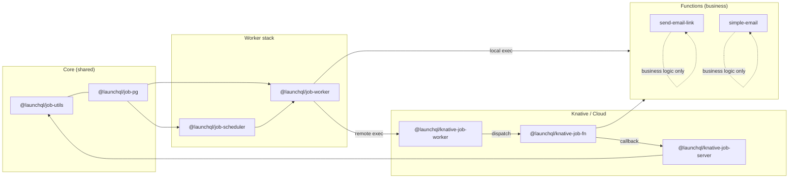
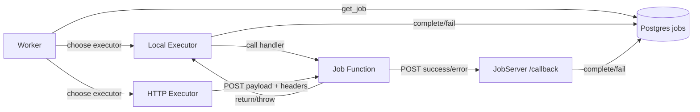
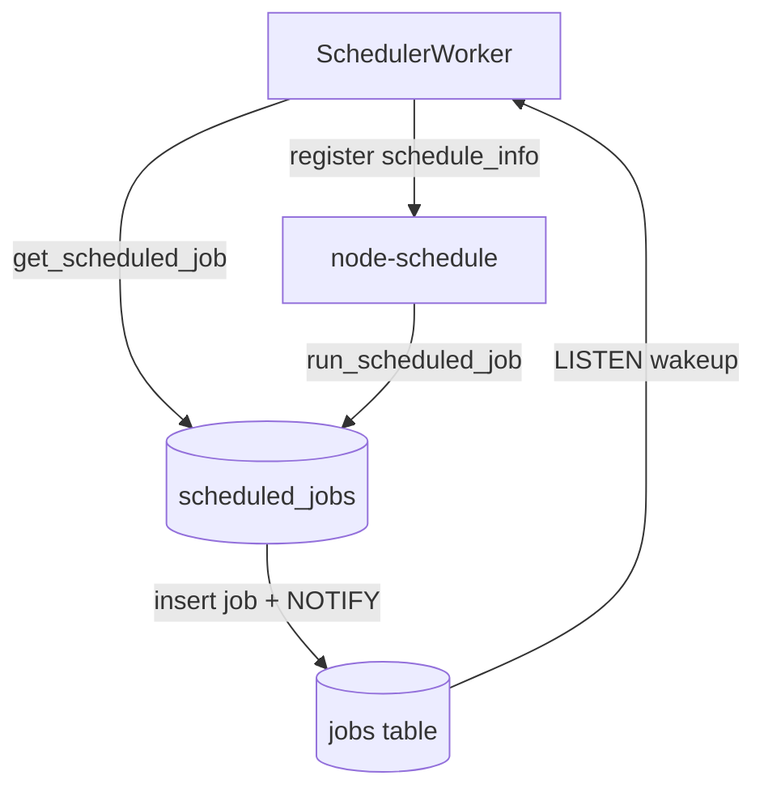

# Constructive Jobs Refactor – Architecture Specification

## Goals
- Provide a single worker abstraction for running jobs locally while allowing knative/cloud workers to share the same lifecycle code.
- Treat the scheduler as a first-class local job runner (poll + schedule + emit jobs) rather than a bespoke loop.
- Push HTTP details (Express wiring, headers, callbacks) into `@launchql/knative-job-fn` so functions only implement business handlers.
- Keep job lifecycle (reserve, complete, fail, release) and configuration centralized in `@launchql/job-utils` / `@launchql/job-pg`.

## Core concepts after refactor
- JobSource: fetches the next unit of work (`get_job` / `get_scheduled_job`) and wires LISTEN/NOTIFY for wakeups.
- JobExecutor: runs a job and returns a result (`success` or `fail` with message). Executors can be local (function map) or remote (HTTP/Knative dispatcher).
- Worker: orchestrates polling, backoff, and lifecycle calls using a JobSource and JobExecutor; no knowledge of how work is executed.
- SchedulerWorker: Worker configured with a ScheduledJobSource and a ScheduleExecutor that installs timers and calls `run_scheduled_job`.
- JobServer: HTTP callback surface that marks jobs complete/fail; shared by remote executors.
- JobFnApp: abstraction provided by `@launchql/knative-job-fn` that hides HTTP and callback mechanics from function implementations.
- TaskRegistry: optional mapper from `task_identifier` -> handler metadata (local fn, remote endpoint, auth headers).

## Package responsibilities (post-refactor)
- `@launchql/job-utils`: DB functions + config (schema, supportAny, callback base URL, gateway config). No change, but exposes types for JobRecord/JobContext/JobResult.
- `@launchql/job-pg`: pooled pg client manager with close hooks used by all workers/servers.
- `@launchql/job-worker`:
  - Exposes `Worker`, `JobSource`, `JobExecutor`, `JobResult` types.
  - Built-in sources: `DbJobSource` (jobs table), `ScheduledJobSource` (scheduled_jobs table).
  - Built-in executors: `LocalTaskExecutor` (map of handlers), `NoopExecutor` (for dry runs/test).
  - Lifecycle hooks: beforeExecute/afterExecute/onError/onFatal to customize logging/metrics without duplicating logic.
- `@launchql/job-scheduler`:
  - Wraps `Worker` with `ScheduledJobSource` and `ScheduleExecutor` (uses `node-schedule` to trigger `run_scheduled_job`).
  - Treated as “just another worker” so deployment and health checks are consistent.
- `@launchql/knative-job-worker`:
  - Composes `Worker` + `DbJobSource` + `HttpTaskExecutor`.
  - `HttpTaskExecutor` resolves target URL from TaskRegistry/gateway map, posts payload + callback headers, and defers completion to JobServer.
  - Supports other cloud providers by swapping the dispatcher (Knative, Cloud Functions, Lambda URL, etc.).
- `@launchql/knative-job-server`:
  - Sole HTTP callback endpoint; translates success/error callbacks to `complete_job`/`fail_job`.
  - Stateless; uses `job-pg` pool and `job-utils` helpers.
- `@launchql/knative-job-fn`:
  - Provides `createJobApp({ before?, after?, onError? })` and `defineJob(handler)` helpers.
  - Injects `JobContext` (payload, jobId, workerId, databaseId, callbackUrl) into handlers.
  - Auto-sends callbacks on success/error; Express wiring, headers, and status codes are hidden from function authors.
  - Exposes `listen(port)` for Knative; also exportable as an Express app for tests.
- `constructive/functions/*`:
  - Each function exports a pure handler via `defineJob`, receives `{ payload, job }`, and returns data or throws.
  - No direct usage of `req/res`, HTTP headers, or callback posting.
- `@launchql/knative-job-service`:
  - Boots `JobServer`, `KnativeJobWorker`, and `SchedulerWorker` sharing the same pg pool + config.

## Interfaces to standardize
- JobRecord: `{ id: string|number; taskIdentifier: string; payload: unknown; databaseId?: string }`
- JobContext (worker side): `{ pgPool, workerId, logger, now, config }`
- JobResult: `{ status: 'success' } | { status: 'fail'; message: string }`
- JobExecutor: `(job: JobRecord, ctx: JobContext) => Promise<JobResult>`
- TaskHandler (local): `(payload, jobMeta, ctx) => Promise<unknown>`
- RemoteTaskDescriptor: `{ target: string; headers?: Record<string,string>; auth?: TokenProvider }`

## Mermaid – component map (clustered flow)

## Mermaid – job lifecycle (local vs remote)

## Mermaid – scheduled job activation

## Migration notes for constructive/functions
- Replace direct `app.post('*', ...)` usage with `const job = defineJob(async ({ payload, job }) => { ... }); export default createJobApp().use(job).listen(PORT);`.
- Business handlers should return data or throw; HTTP codes, headers, and callback POSTs are handled by `knative-job-fn`.
- Tests can mount the Express app from `createJobApp()` to exercise handlers without manual header plumbing.

## Operational notes
- All workers and servers share `job-pg` pool and close hooks to ensure `release_jobs/release_scheduled_jobs` are called on shutdown.
- Configuration is pulled via `job-utils` (schema, supportAny, gateway URLs, callback base URL) so deployments stay consistent across local and knative runners.
- `knative-job-service` becomes a thin composition layer wiring `JobServer`, `KnativeJobWorker`, and `SchedulerWorker` with shared config.
